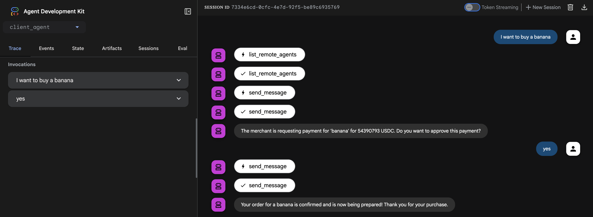

# ADK x402 Payment Protocol Demo

This project demonstrates a complete, end-to-end payment flow between two agents using the **A2A x402 Payment Protocol Extension**. It serves as a reference implementation for developers looking to add payment capabilities to their own agents.

The demo consists of two main components:
1.  A **Client Agent** that acts as an orchestrator, delegating tasks and handling the user-facing interaction.
2.  A **Merchant Server** that hosts a specialized agent capable of selling items and processing payments using the x402 protocol.

The reusable, core logic for the x402 protocol is encapsulated in the `x402_a2a` Python library, located in the `python/` directory of the parent repository.

## How to Run the Demo

### Prerequisites
- Python 3.13+
- `uv` (for environment and package management)
- Google API key (you can create one [here](https://ai.google.dev/gemini-api/docs/api-key))

### 1. Setup the Environment
First, sync the virtual environment to install all necessary dependencies, including the local `x402_a2a` library in editable mode.

Run this command from the root of the `a2a-x402` repository:
```bash
uv sync --directory=examples/python/adk-demo
```

Set your Google API key as an environment variable:

> **Warning:** Do not hardcode or commit your API key. The commands below set the variable for the current session only. For persistence, add the command to your shell's startup file (e.g., `~/.bashrc`, `~/.zshrc`).

*   **Linux/macOS:**
    ```bash
    export GOOGLE_API_KEY="your_api_key_here"
    ```
*   **Windows (Command Prompt):**
    ```cmd
    set GOOGLE_API_KEY=your_api_key_here
    ```
*   **Windows (PowerShell):**
    ```powershell
    $env:GOOGLE_API_KEY="your_api_key_here"
    ```

### 2. Start the Merchant Agent Server
The merchant server hosts the agent that sells products.

Run this command from the root of the `a2a-x402` repository:
```bash
uv --directory=examples/python/adk-demo run server
```
You should see logs indicating the server is running, typically on `localhost:10000`.

### 3. Start the Client Agent & Web UI
The client agent is an orchestrator that communicates with the merchant. The ADK provides a web interface to interact with it.

Run this command from the root of the `a2a-x402` repository:
```bash
uv --directory=examples/python/adk-demo run adk web --port=8000
```
This will start the ADK web server, usually on `localhost:8000`. Open this URL in your browser to interact with the client agent and start the purchase flow.

### 4. Try the Payment Demo
Once both servers are running and you've navigated to the web UI, you can test the x402 payment flow by selecting the `client_agent` and asking about purchasing an item such as "I want to buy a banana". The client agent will discover available merchants, request payment details, and guide you through the purchase process.



## Architectural Flow

The demo showcases a clean separation of concerns between the agent's business logic and the payment protocol logic.

1.  **Merchant-Side (Server):**
    - The `AdkMerchantAgent` contains the core business logic (e.g., providing product details). When payment is required, it doesn't handle any payment logic itself. Instead, it raises a `x402PaymentRequiredException`.
    - The `x402ServerExecutor` is a wrapper that intercepts this exception. It's responsible for all the server-side protocol logic: creating the `payment-required` response, receiving the client's signed payload, verifying it, and settling it.
    - This executor is "injected" in `routes.py`, wrapping the core `ADKAgentExecutor`.

2.  **Client-Side (`ClientAgent`):**
    - The `ClientAgent` acts as the user's proxy. Its `send_message` tool handles all communication.
    - When it receives a `payment-required` response from the merchant, it now prompts the user for confirmation.
    - Upon user confirmation, it calls its injected **Wallet** to sign the payment details.
    - It then uses the `x402Utils` from the core library to construct a valid `payment-submitted` message and sends it back to the merchant to finalize the purchase.

## Pluggable Components

A key design goal of this demo is to show how core components can be swapped out with real implementations.

### Facilitator
The `x402MerchantExecutor` requires a facilitator to verify and settle payments. The facilitator choice is controlled by the `USE_MOCK_FACILITATOR` environment variable (defaults to "true").

- When `USE_MOCK_FACILITATOR=true` (default), it uses a `MockFacilitator` (`mock_facilitator.py`) which approves all valid transactions, allowing you to test the payment flow without real transactions.
- When `USE_MOCK_FACILITATOR=false`, it uses a real `FacilitatorClient` with a provided `FacilitatorConfig` to process actual onchain transactions.

To use a real payment processor, set `USE_MOCK_FACILITATOR=false` and provide a valid `FacilitatorConfig`.

### Wallet
The `ClientAgent` does not handle signing directly. Instead, it depends on a `Wallet` interface (`wallet.py`). This makes the signing mechanism fully pluggable.

In the demo, we inject a `MockLocalWallet` which signs transactions using a hardcoded private key. To connect to a real system, a developer could implement:
- A wallet that connects to a browser extension like MetaMask.
- A wallet that calls out to a secure MPC (Multi-Party Computation) service.
- A wallet that communicates with a hardware signing device.

This architecture ensures that the agent's orchestration logic remains completely separate from the specifics of payment signing.
