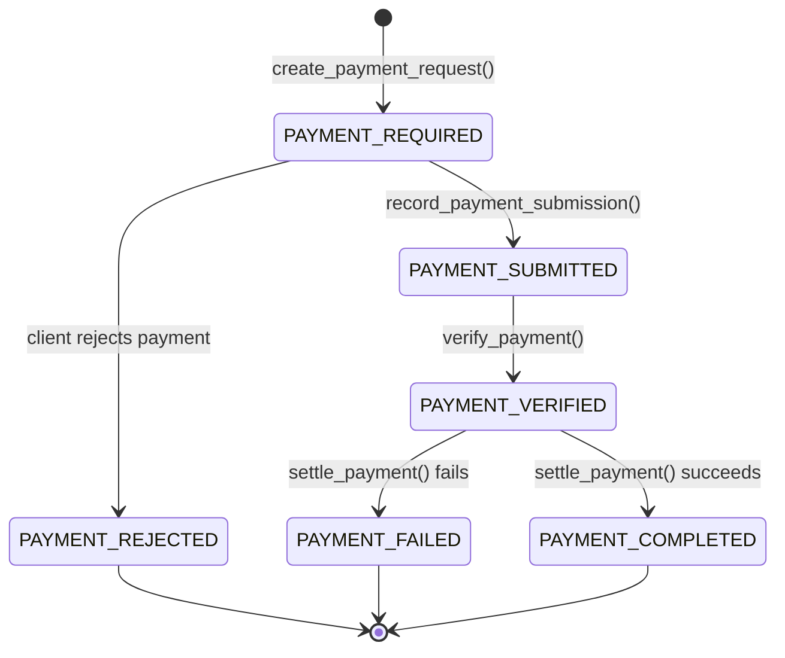

# x402 A2A Payment Protocol Extension

This package provides a complete implementation of the x402 payment protocol extension for A2A using an **exception-based approach** for dynamic payment requirements. 

## 🚀 Exception-Based Payment Requirements

Instead of static configuration, delegate agents throw `x402PaymentRequiredException` to request payment dynamically:

```python
from x402_a2a import x402PaymentRequiredException

# In your agent logic:
if is_premium_feature(request):
    raise x402PaymentRequiredException.for_service(
        price="$5.00",
        pay_to_address="0x123...",
        resource="/premium-feature"
    )

# Or use helper decorators:
@require_payment(price="$2.00", pay_to_address="0x456...", resource="/ai-service")
async def generate_content(prompt):
    return ai_service.generate(prompt)
```

This approach enables:
- **Dynamic pricing** based on request parameters
- **Per-service payment requirements** without configuration
- **Multiple payment options** (basic, premium, ultra tiers)
- **Clean separation** between business logic and payment logic

## Architecture Overview

The package follows a "functional core, imperative shell" architecture. The core protocol is implementation-agnostic and can be used independently, while executors provide optional middleware for common integration patterns.

## 1. Core Protocol Architecture

The x402 extension separates **protocol requirements** from **implementation patterns**:

### 1.1. Package Structure

```
x402_a2a/
├── types/               # Protocol Data Structures (Required)
│   ├── config.py        # Configuration types
│   ├── messages.py      # Core protocol message types
│   ├── errors.py        # Protocol error types
│   └── state.py         # Payment state definitions
├── core/               # Protocol Implementation (Required)
│   ├── merchant.py      # Payment requirements creation
│   ├── wallet.py        # Payment signing and processing
│   ├── protocol.py      # Core protocol operations
│   └── utils.py         # State management utilities
├── executors/          # Optional Middleware
│   ├── base.py         # Base executor types
│   ├── client.py       # Client-side executor
│   └── server.py       # Server-side executor
└── extension.py        # Extension declaration
```

## 2. Core Protocol Requirements

### 2.1. Required Data Structures

The x402_a2a package leverages core types from the `x402.types` package and extends them with A2A-specific structures.

#### **From `x402.types` (Core x402 Protocol)**

These types are imported directly from the x402 protocol package:

```python
from x402.types import (
    PaymentRequirements,           # Core payment requirements structure
    x402PaymentRequiredResponse,   # Payment required response from merchant
    PaymentPayload,               # Signed payment authorization
    VerifyResponse,               # Payment verification result  
    SettleResponse               # Payment settlement result
)
```

**`PaymentRequirements`** - Describes payment options:
- `scheme: str` - Payment scheme (e.g., "exact")
- `network: SupportedNetworks` - Blockchain network 
- `asset: str` - Token contract address
- `pay_to: str` - Recipient wallet address
- `max_amount_required: str` - Payment amount in atomic units
- `resource: str` - Resource identifier
- `description: str` - Human-readable description
- `max_timeout_seconds: int` - Payment validity timeout
- `mime_type: str` - Expected response content type
- `output_schema: Optional[Any]` - Response schema
- `extra: Optional[dict]` - Scheme-specific additional data

**`x402PaymentRequiredResponse`** - Initial payment request:
- `x402_version: int` - Protocol version (1)
- `accepts: list[PaymentRequirements]` - Array of payment options
- `error: str` - Error message if applicable

**`PaymentPayload`** - Signed payment authorization:
- `x402_version: int` - Protocol version
- `scheme: str` - Payment scheme used
- `network: str` - Blockchain network
- `payload: SchemePayloads` - Scheme-specific signed data (e.g., `ExactPaymentPayload`)

#### **New to `x402_a2a.types` (A2A Extension)**

These types are specific to the A2A protocol extension:

```python
from x402_a2a.types import (
    PaymentStatus,        # A2A payment state enum
    x402MessageType,      # A2A message type enum
    x402Metadata,         # A2A metadata key constants
    x402ServerConfig      # Server payment configuration
)
```

**`PaymentStatus`** - A2A payment state enumeration:
```python
class PaymentStatus(str, Enum):
    """Protocol-defined payment states for A2A flow"""
    PAYMENT_REQUIRED = "payment-required"    # Payment requested
    PAYMENT_SUBMITTED = "payment-submitted"  # Payment signed and submitted
    PAYMENT_VERIFIED = "payment-verified"    # Payment has been verified by facilitator
    PAYMENT_REJECTED = "payment-rejected"    # Payment requirements rejected by client
    PAYMENT_COMPLETED = "payment-completed"  # Payment settled successfully
    PAYMENT_FAILED = "payment-failed"        # Payment processing failed
```

**`x402MessageType`** - Message type constants (x402_a2a.types.messages):
```python  
class x402MessageType(str, Enum):
    """Message type identifiers for A2A x402 flow"""
    PAYMENT_REQUIRED = "x402.payment.required"      # Initial payment request
    PAYMENT_PAYLOAD = "x402.payment.payload"        # Signed payment submission
    PAYMENT_SETTLED = "x402.payment.settled"        # Settlement completion
```

**`x402ServerConfig`** - Server payment configuration (x402_a2a.types.config):
```python
class x402ServerConfig(BaseModel):
    """Configuration for how a server expects to be paid"""
    price: Union[str, int, TokenAmount]        # Payment price (Money or TokenAmount)
    pay_to_address: str                        # Ethereum address to receive payment
    network: str = "base"                      # Blockchain network
    description: str = "Payment required..."   # Human-readable description
    mime_type: str = "application/json"        # Expected response type
    max_timeout_seconds: int = 600             # Payment validity timeout
    resource: Optional[str] = None             # Resource identifier (e.g., '/api/generate')
    asset_address: Optional[str] = None        # Token contract (auto-derived for USDC if None)
```

### 2.3. Required Metadata Keys

Implementations MUST use these exact metadata keys in Task and Message objects:

```python
class x402Metadata:
    """Spec-defined metadata key constants (x402_a2a.types.state)"""
    STATUS_KEY = "x402.payment.status"
    REQUIRED_KEY = "x402.payment.required"      # Contains x402PaymentRequiredResponse
    PAYLOAD_KEY = "x402.payment.payload"        # Contains PaymentPayload
    RECEIPTS_KEY = "x402.payment.receipts"      # Contains array of SettleResponse objects
    ERROR_KEY = "x402.payment.error"            # Error code (when failed)
```

### 2.4. Extension Declaration & Activation

```python
# Extension URI constant
X402_EXTENSION_URI = "https://github.com/google-a2a/a2a-x402/v0.1"

    def get_extension_declaration(
    description: str = "Supports x402 payments", 
        required: bool = True
) -> dict:
        """Creates extension declaration for AgentCard."""
    return {
        "uri": X402_EXTENSION_URI,
        "description": description,
        "required": required
    }

def check_extension_activation(request_headers: dict) -> bool:
    """Check if x402 extension is activated via HTTP headers."""
    extensions = request_headers.get("X-A2A-Extensions", "")
    return X402_EXTENSION_URI in extensions

def add_extension_activation_header(response_headers: dict) -> dict:
    """Echo extension URI in response header to confirm activation."""
    response_headers["X-A2A-Extensions"] = X402_EXTENSION_URI
    return response_headers
```

### 2.5. Task Correlation Mechanism

```python
def create_payment_submission_message(
    task_id: str,  # CRITICAL: Original task ID for correlation
    payment_payload: PaymentPayload,
    text: str = "Payment authorization provided",
    message_id: Optional[str] = None  # Optional specific message ID
) -> Message:
    """Creates correlated payment submission message per spec."""
    return Message(
        task_id=task_id,  # Spec mandates this correlation
        role="user", 
        parts=[{"kind": "text", "text": text}],
        metadata={
            x402Metadata.STATUS_KEY: PaymentStatus.PAYMENT_SUBMITTED.value,
            x402Metadata.PAYLOAD_KEY: payment_payload.model_dump(by_alias=True)
        }
    )

def extract_task_id(message: Message) -> Optional[str]:
    """Extracts task ID for correlation from payment message."""
    return getattr(message, 'task_id', None)
```

## 3. Architecture Role Mapping

The spec defines communication between Client Agent and Merchant Agent. The roles below show **recommended patterns** for organizing payment functionality. These are **architectural examples** showing how different systems might handle their responsibilities - they are not code classes that will be imported from the package:

### 3.1. Client Agent Role
*Example architectural pattern - represents a separate system/service*

```python
class ClientAgentOperations:
    """Example: How a Client Agent system might organize payment orchestration."""
    
    @staticmethod
    async def relay_to_signing_service(
        payment_required: x402PaymentRequiredResponse,
        signing_service: SigningService
    ) -> PaymentPayload:
        """Forward payment requirements to signing service for authorization."""
        # Signing service receives entire x402PaymentRequiredResponse
        # Returns complete PaymentPayload with selected requirement and signature
        return await signing_service.process_payment_required(payment_required)
    
    @staticmethod
    async def submit_payment_to_merchant(
        task_id: str,
        payment_payload: PaymentPayload,
        merchant_agent: MerchantAgent
    ) -> Task:
        """Submit signed payment authorization back to merchant with task correlation."""
        message = create_payment_submission_message(task_id, payment_payload)
        return await merchant_agent.process_payment(message)
```

### 3.2. Merchant Agent Role
*Example architectural pattern - represents a separate system/service*

```python
class MerchantAgentOperations:
    """Example: How a Merchant Agent system might handle payment processing."""
    
    @staticmethod
    def create_payment_request(
        config: PaymentRequirementsConfig
    ) -> Tuple[Task, x402PaymentRequiredResponse]:
        """Create payment requirements and task when payment is needed for a service."""
        requirements = create_payment_requirements(config)
        payment_required = x402PaymentRequiredResponse(
            x402_version=1,
            accepts=[requirements]
        )
        
        task = Task(
            id=generate_task_id(),
            status=TaskStatus(state=TaskState.input_required),
            metadata={
                x402Metadata.STATUS_KEY: PaymentStatus.PAYMENT_REQUIRED,
                x402Metadata.REQUIRED_KEY: payment_required.model_dump(by_alias=True)
            }
        )
        
        return task, payment_required
    
    @staticmethod
    async def process_settlement(
        payment_payload: PaymentPayload,
        payment_requirements: PaymentRequirements,
        facilitator_config: FacilitatorConfig
    ) -> SettleResponse:
        """Verify and settle payment after receiving signed authorization."""
        # Verify payment signature and requirements with facilitator
        verification = await verify_payment(payment_payload, payment_requirements, facilitator_config)
        if not verification.is_valid:
            return SettleResponse(
                success=False,
                network=payment_requirements.network,
                error_reason=verification.invalid_reason
            )
        
        # Settle payment on blockchain via facilitator
        return await settle_payment(payment_payload, payment_requirements, facilitator_config)
```

### 3.3. Signing Service Role (Recommended Architecture)
*Example architectural pattern - can be separate system or integrated with Client*

The spec defines communication between Client Agent and Merchant Agent. The signing service is a **recommended architectural pattern** for security and domain separation, but the spec does not mandate how signing is implemented.

**Architectural Options:**

1. **Separate Signing Service (Recommended)**:
   - Client Agent communicates with independent signing service
   - Clear security boundary and domain separation  
   - Signing service can be server-side, hardware wallet, MPC, etc.

2. **Integrated Signing (Spec Compliant)**:
   - Client Agent includes signing capabilities directly
   - Still meets spec requirements for communication flow
   - Implementation choice based on security model

```python
class SigningServiceOperations:
    """Example: How a Signing Service might be structured (not actual importable code)."""
    
    def __init__(self, account: Account):
        self._account = account  # Implementation detail - could be HSM, MPC, etc.
        
    async def process_payment_required(
        self,
        payment_required: x402PaymentRequiredResponse,
        max_value: Optional[int] = None
    ) -> PaymentPayload:
        """Process payment requirements: select, sign, and return payment payload."""
        # Select appropriate payment requirement from available options
        selected_requirement = self._select_payment_requirement(payment_required.accepts)
        
        # Sign the selected requirement using private key
        payment_payload = await process_payment(selected_requirement, self._account, max_value)
        
        # Return signed payment payload ready for merchant submission
        return payment_payload
    
    def _select_payment_requirement(
        self, 
        accepts: list[PaymentRequirements]
    ) -> PaymentRequirements:
        """Payment selection logic - customize based on implementation needs."""
        return accepts[0]  # Simple default - can be enhanced
```

### 3.4. Facilitator Role
*Example architectural pattern - represents a separate blockchain/settlement service*

```python
class FacilitatorOperations:
    """Example: How a Facilitator service might handle on-chain operations."""
    
    @staticmethod
    async def verify_payment_payload(
        payment_payload: PaymentPayload,
        payment_requirements: PaymentRequirements
    ) -> VerificationResult:
        """Verify payment signature and requirements before processing."""
        return await verify_payment(payment_payload, payment_requirements)
    
    @staticmethod
    async def settle_on_chain(
        payment_payload: PaymentPayload,
        payment_requirements: PaymentRequirements
    ) -> SettleResponse:
        """Post payment transaction to blockchain after successful verification."""
        return await settle_payment(payment_payload, payment_requirements)
```

## 4. Core Protocol Implementation

The `/core` module provides implementation-agnostic functions for the protocol operations:

### 4.1. Core Function Interface

Functions implemented in `x402_a2a.core`:

```python
# Payment Requirements Creation (x402_a2a.core.merchant)
def create_payment_requirements(
    price: Union[str, int, TokenAmount],  # Price can be Money or TokenAmount
    pay_to_address: str,
    resource: str,
    network: str = "base",
    description: str = "",
    mime_type: str = "application/json",
    scheme: str = "exact",
    max_timeout_seconds: int = 600,
    output_schema: Optional[Any] = None,
    **kwargs
) -> PaymentRequirements:
    """Creates PaymentRequirements object using x402's price processing."""

# Payment Processing (x402_a2a.core.wallet)  
def process_payment_required(
    payment_required: x402PaymentRequiredResponse,
    account: Account,
    max_value: Optional[int] = None
) -> PaymentPayload:
    """Process full payment required response - uses x402.clients.base.x402Client.
    
    Returns signed PaymentPayload with selected requirement.
    """

def process_payment(
    requirements: PaymentRequirements,
    account: Account,
    max_value: Optional[int] = None
) -> PaymentPayload:
    """Create PaymentPayload - extends x402.clients.base.x402Client.create_payment_header.
    
    Same as create_payment_header but returns PaymentPayload object (not base64 encoded).
    """

# Payment Verification (x402_a2a.core.protocol)
def verify_payment(
    payment_payload: PaymentPayload,
    payment_requirements: PaymentRequirements,
    facilitator_client: Optional[FacilitatorClient] = None
) -> VerifyResponse:
    """Verify payment - calls facilitator_client.verify()."""

# Payment Settlement (x402_a2a.core.protocol)  
def settle_payment(
    payment_payload: PaymentPayload,
    payment_requirements: PaymentRequirements,
    facilitator_client: Optional[FacilitatorClient] = None
) -> SettleResponse:
    """Settle payment - calls facilitator_client.settle() and returns SettleResponse directly."""
```

### 4.2. State Management Utilities  

The `x402Utils` class in `x402_a2a.core.utils`:

```python
class x402Utils:
    """Core utilities for x402 protocol state management."""
    
    # Metadata keys as defined by spec
    STATUS_KEY = "x402.payment.status"
    REQUIRED_KEY = "x402.payment.required"      # Contains x402PaymentRequiredResponse
    PAYLOAD_KEY = "x402.payment.payload"        # Contains PaymentPayload  
    RECEIPTS_KEY = "x402.payment.receipts"      # Contains array of SettleResponse objects
    ERROR_KEY = "x402.payment.error"            # Error code string

    def get_payment_status_from_message(self, message: Message) -> Optional[PaymentStatus]:
        """Extract payment status from message metadata."""
        if not message or not hasattr(message, 'metadata') or not message.metadata:
            return None
        status_value = message.metadata.get(self.STATUS_KEY)
        if status_value:
            try:
                return PaymentStatus(status_value)
            except ValueError:
                return None
        return None
    
    def get_payment_status_from_task(self, task: Task) -> Optional[PaymentStatus]:
        """Extract payment status from task's status message metadata."""
        if not task or not hasattr(task, 'status') or not task.status:
            return None
        if not hasattr(task.status, 'message') or not task.status.message:
            return None
        return self.get_payment_status_from_message(task.status.message)
    
    def get_payment_status(self, task: Task) -> Optional[PaymentStatus]:
        """Extract payment status from task (updated to use task status message)."""
        return self.get_payment_status_from_task(task)

    def get_payment_requirements_from_message(self, message: Message) -> Optional[x402PaymentRequiredResponse]:
        """Extract payment requirements from message metadata."""
        if not message or not hasattr(message, 'metadata') or not message.metadata:
            return None
        req_data = message.metadata.get(self.REQUIRED_KEY)
        if req_data:
            try:
                return x402PaymentRequiredResponse.model_validate(req_data)
            except Exception:
                return None
        return None
    
    def get_payment_requirements_from_task(self, task: Task) -> Optional[x402PaymentRequiredResponse]:
        """Extract payment requirements from task's status message metadata."""
        if not task or not hasattr(task, 'status') or not task.status:
            return None
        if not hasattr(task.status, 'message') or not task.status.message:
            return None
        return self.get_payment_requirements_from_message(task.status.message)
    
    def get_payment_requirements(self, task: Task) -> Optional[x402PaymentRequiredResponse]:
        """Extract payment requirements from task (updated to use task status message)."""
        return self.get_payment_requirements_from_task(task)

    def get_payment_payload_from_message(self, message: Message) -> Optional[PaymentPayload]:
        """Extract payment payload from message metadata."""
        if not message or not hasattr(message, 'metadata') or not message.metadata:
            return None
        payload_data = message.metadata.get(self.PAYLOAD_KEY)
        if payload_data:
            try:
                return PaymentPayload.model_validate(payload_data)
            except Exception:
                return None
        return None
    
    def get_payment_payload_from_task(self, task: Task) -> Optional[PaymentPayload]:
        """Extract payment payload from task's status message metadata."""
        if not task or not hasattr(task, 'status') or not task.status:
            return None
        if not hasattr(task.status, 'message') or not task.status.message:
            return None
        return self.get_payment_payload_from_message(task.status.message)
    
    def get_payment_payload(self, task: Task) -> Optional[PaymentPayload]:
        """Extract payment payload from task (updated to use task status message)."""
        return self.get_payment_payload_from_task(task)

    def create_payment_required_task(
        self,
        task: Task,
        payment_required: x402PaymentRequiredResponse
    ) -> Task:
        """Set task to payment required state with proper metadata."""
        # Set task status to input-required as per A2A spec
        task.status = TaskStatus(state=TaskState.input_required)
        
        # Ensure task has a status message for metadata
        if not hasattr(task.status, 'message') or not task.status.message:
            task.status.message = Message(
                messageId=f"{task.id}-status",
                role="agent",
                parts=[TextPart(kind="text", text="Payment is required for this service.")],
                metadata={}
            )
        
        # Ensure message has metadata
        if not hasattr(task.status.message, 'metadata') or not task.status.message.metadata:
            task.status.message.metadata = {}
            
        task.status.message.metadata[self.STATUS_KEY] = PaymentStatus.PAYMENT_REQUIRED.value
        task.status.message.metadata[self.REQUIRED_KEY] = payment_required.model_dump(by_alias=True)
        return task
    
    def record_payment_submission(
        self,
        task: Task,
        payment_payload: PaymentPayload
    ) -> Task:
        """Record payment submission in task metadata."""  
        # Ensure task has a status message for metadata
        if not hasattr(task.status, 'message') or not task.status.message:
            task.status.message = Message(
                messageId=f"{task.id}-status",
                role="agent",
                parts=[TextPart(kind="text", text="Payment submission recorded.")],
                metadata={}
            )
        
        # Ensure message has metadata
        if not hasattr(task.status.message, 'metadata') or not task.status.message.metadata:
            task.status.message.metadata = {}
            
        task.status.message.metadata[self.STATUS_KEY] = PaymentStatus.PAYMENT_SUBMITTED.value
        task.status.message.metadata[self.PAYLOAD_KEY] = payment_payload.model_dump(by_alias=True)
        # Note: Keep requirements for verification - will be cleaned up after settlement
        return task

    def record_payment_success(
        self,
        task: Task,
        settle_response: SettleResponse
    ) -> Task:
        """Record successful payment with settlement response."""
        # Ensure task has a status message for metadata
        if not hasattr(task.status, 'message') or not task.status.message:
            task.status.message = Message(
                messageId=f"{task.id}-status",
                role="agent",
                parts=[TextPart(kind="text", text="Payment completed successfully.")],
                metadata={}
            )
        
        # Ensure message has metadata
        if not hasattr(task.status.message, 'metadata') or not task.status.message.metadata:
            task.status.message.metadata = {}
            
        task.status.message.metadata[self.STATUS_KEY] = PaymentStatus.PAYMENT_COMPLETED.value
        # Append to receipts array (spec requirement for complete history)
        if self.RECEIPTS_KEY not in task.status.message.metadata:
            task.status.message.metadata[self.RECEIPTS_KEY] = []
        task.status.message.metadata[self.RECEIPTS_KEY].append(settle_response.model_dump(by_alias=True))
        # Clean up intermediate data
        task.status.message.metadata.pop(self.PAYLOAD_KEY, None)
        task.status.message.metadata.pop(self.REQUIRED_KEY, None)
        return task

    def record_payment_failure(
        self,
        task: Task,
        error_code: str,
        settle_response: SettleResponse
    ) -> Task:
        """Record payment failure with error details."""
        # Ensure task has a status message for metadata
        if not hasattr(task.status, 'message') or not task.status.message:
            task.status.message = Message(
                messageId=f"{task.id}-status",
                role="agent",
                parts=[TextPart(kind="text", text="Payment failed.")],
                metadata={}
            )
        
        # Ensure message has metadata
        if not hasattr(task.status.message, 'metadata') or not task.status.message.metadata:
            task.status.message.metadata = {}
            
        task.status.message.metadata[self.STATUS_KEY] = PaymentStatus.PAYMENT_FAILED.value
        task.status.message.metadata[self.ERROR_KEY] = error_code
        # Append to receipts array (spec requirement for complete history)
        if self.RECEIPTS_KEY not in task.status.message.metadata:
            task.status.message.metadata[self.RECEIPTS_KEY] = []
        task.status.message.metadata[self.RECEIPTS_KEY].append(settle_response.model_dump(by_alias=True))
        # Clean up intermediate data
        task.status.message.metadata.pop(self.PAYLOAD_KEY, None)
        return task
```

## 5. Security Considerations

The spec defines **protocol-level security requirements** that implementations MUST follow, but does not prescribe specific implementation details:

### 5.1. Implementation Flexibility

The signing service architecture is **recommended** for security and domain separation, but the spec technically only defines communication between Client Agent and Merchant Agent. Implementations can:

- Use separate signing services (recommended)
- Integrate signing into the host agent (spec compliant)  
- Choose any appropriate communication method between host and signing service
- Implement security measures appropriate for their deployment model

### 5.2. Error Code Mapping

```python
class x402ErrorCode:
    """Standard error codes from spec Section 8.1."""
    INSUFFICIENT_FUNDS = "INSUFFICIENT_FUNDS"
    INVALID_SIGNATURE = "INVALID_SIGNATURE"
    EXPIRED_PAYMENT = "EXPIRED_PAYMENT"
    DUPLICATE_NONCE = "DUPLICATE_NONCE"
    NETWORK_MISMATCH = "NETWORK_MISMATCH"
    INVALID_AMOUNT = "INVALID_AMOUNT"
    SETTLEMENT_FAILED = "SETTLEMENT_FAILED"

def map_error_to_code(error: Exception) -> str:
    """Maps implementation errors to spec error codes."""
    error_mapping = {
        ValidationError: x402ErrorCode.INVALID_SIGNATURE,
        PaymentError: x402ErrorCode.SETTLEMENT_FAILED,
        # Add more mappings as needed
    }
    return error_mapping.get(type(error), "UNKNOWN_ERROR")
```

## 6. Complete Protocol Flow

This section describes the end-to-end payment flow between separate systems communicating via A2A protocol. Each step involves network communication between independent services.

### 6.1. Payment Flow Overview

The x402 payment flow involves **four separate systems**:
- **Client Agent**: Orchestrates payment on behalf of user/client
- **Merchant Agent**: Provides paid services, handles settlement
- **Signing Service**: Handles payment authorization (can be separate or integrated with Client)
- **Facilitator**: Verifies and settles payments on-chain

### 6.2. Step-by-Step Protocol Flow

#### **Steps 1-2: Service Request & Payment Requirements**

**Client Agent → Merchant Agent**
- Client sends A2A service request message
- Merchant determines payment is required for this service

**Merchant Agent → Client Agent**
- Merchant responds with `Task` (state: `input-required`)
- Task metadata contains `x402.payment.status: "payment-required"`
- Task metadata contains `x402.payment.required` with `x402PaymentRequiredResponse`
- Response includes array of acceptable payment methods (`accepts[]`)

#### **Steps 3-4: Payment Authorization**

**Client Agent → Signing Service**
- Client extracts `x402PaymentRequiredResponse` from task metadata
- Client forwards entire payment required response to signing service
- Communication method depends on implementation (HTTP, gRPC, local call, etc.)

**Signing Service Internal Process:**
- Receives full `x402PaymentRequiredResponse` 
- Selects appropriate payment method from `accepts[]` array
- Signs the selected payment requirement
- Creates `PaymentPayload` with signature

**Signing Service → Client Agent**
- Returns signed `PaymentPayload` for the selected payment requirements
- PaymentPayload contains all necessary signature and payment data

#### **Step 5: Payment Submission**

**Client Agent → Merchant Agent**
- Client sends A2A `Message` with payment authorization
- Message **MUST** include `taskId` for correlation with original request
- Message metadata contains `x402.payment.status: "payment-submitted"`
- Message metadata contains `x402.payment.payload` with the signed `PaymentPayload`

#### **Steps 6-7: Payment Verification**

**Merchant Agent Internal Process:**
- Receives payment submission message
- Correlates payment with original service request using `taskId`
- Updates task state to `working`
- Updates task metadata: `x402.payment.status: "payment-pending"`

**Merchant Agent → Facilitator**
- Merchant forwards payment for verification
- Sends `PaymentRequirements` and `PaymentPayload` to facilitator
- Communication method is implementation-specific

**Facilitator → Merchant Agent**
- Returns verification status
- If invalid, includes reason for rejection

#### **Steps 8-9: Settlement & Completion**

**If Verification Successful:**

**Merchant Agent → Facilitator**
- Requests payment settlement on blockchain
- Facilitator posts transaction to appropriate network

**Facilitator → Merchant Agent**
- Returns settlement result with transaction hash

**Merchant Agent Final Response:**
- Updates task state to `completed` (success) or `failed` (error)
- Updates task metadata: `x402.payment.status: "payment-completed"` or `"payment-failed"`
- Adds `x402.payment.receipt` with settlement details (`SettleResponse`)
- Includes service result as task `artifacts` (if successful)

**Merchant Agent → Client Agent**
- Returns final `Task` with completion status and results

### 6.3. Error Handling Flow

At any step, if an error occurs:

1. **Payment Verification Fails (Step 6)**:
   - Merchant updates task state to `failed`
   - Metadata: `x402.payment.status: "payment-failed"`
   - Metadata: `x402.payment.error` with appropriate error code
   - Returns error response to Client

2. **Settlement Fails (Step 8)**:
   - Same error handling as verification failure
   - May include partial transaction information

3. **Network/Communication Failures**:
   - Standard A2A error handling applies
   - Timeout and retry policies per implementation

### 6.4. Implementation Considerations

- **All communications** use A2A protocol message format
- **Task correlation** via `taskId` is critical for payment tracking
- **State management** happens independently in each system
- **Network boundaries** exist between all components
- **Security** relies on proper message validation and transport security
- **Facilitator integration** method varies by implementation (API calls, blockchain direct, etc.)

## 7. Core Usage (Direct Implementation)

Developers can use the core functions directly without executors:

### 7.1. Merchant Implementation

```python
# Core x402 Protocol Types
from x402.types import PaymentRequirements, x402PaymentRequiredResponse

# A2A Extension Functions & Types
from x402_a2a import (
    create_payment_requirements,
    settle_payment,
    x402Utils,
    x402Metadata,
    x402ErrorCode
)
from x402.facilitator import FacilitatorClient

utils = x402Utils()

# Handle payment request
async def handle_payment_request(task: Task, price: str, resource: str):
    # Create requirements
    requirements = create_payment_requirements(
        price=price,  # Can be "$1.00", 1.00, or TokenAmount
        pay_to_address="0x...",  # Merchant's address
        resource=resource,
        network="base",
        description="Service payment"
    )
    
    # Create payment required response
    payment_required = x402PaymentRequiredResponse(
        x402_version=1,
        accepts=[requirements]
    )
    
    # Update task state
    task = utils.create_payment_required_task(task, payment_required)
    return task

# Handle payment submission
async def handle_payment_submission(task: Task, payment_requirements: PaymentRequirements):
    # Get payment payload from task using utility method
    payment_payload = utils.get_payment_payload(task)
    
    # Verify payment first
    facilitator_client = FacilitatorClient({"url": "https://x402.org/facilitator"})
    verify_response = await facilitator_client.verify(
        payment_payload, 
        payment_requirements
    )
    
    if not verify_response.is_valid:
        task = utils.record_payment_failure(
            task, "verification_failed", 
            SettleResponse(success=False, network="base", error_reason=verify_response.invalid_reason)
        )
        return task
    
    # Settle payment after verification
    settle_response = await facilitator_client.settle(
        payment_payload,
        payment_requirements
    )
    
    # Use SettleResponse directly from x402
    settle_response_result = SettleResponse(
        success=settle_response.success,
        transaction=settle_response.transaction,
        network=settle_response.network or "base",
        payer=settle_response.payer,
        error_reason=settle_response.error_reason
    )
    
    # Update task state based on result
    if settle_response.success:
        task = utils.record_payment_success(task, settle_response_result)
    else:
        task = utils.record_payment_failure(task, "settlement_failed", settle_response_result)
    
    return task
```

### 7.2. Wallet Implementation

```python
# Core x402 Protocol Types
from x402.types import PaymentRequirements, x402PaymentRequiredResponse

# A2A Extension Functions & Types  
from x402_a2a import (
    process_payment_required,
    x402Utils,
    x402Metadata
)
from eth_account import Account

# Handle payment requirements
async def handle_payment_requirements(task: Task, account: Account):
    # Get requirements from task metadata
    utils = x402Utils()
    payment_required = utils.get_payment_requirements(task)
    
    # Use x402Client for payment selection and signing
    from x402.clients.base import x402Client
    client = x402Client(account=account, max_value=1000000)
    
    # Select payment requirement from accepts array
    selected_requirement = client.select_payment_requirements(payment_required.accepts)
    
    # Create payment payload (like create_payment_header but returns PaymentPayload)
    payment_payload = await process_payment(selected_requirement, account)
    
    # Update task state
    task = utils.record_payment_submission(task, payment_payload)
    return task
```

## 8. Optional Executor Middleware

The `/executors` module provides optional middleware for common integration patterns. **These are convenience wrappers and are not required** if you implement the core functions directly.

### 8.1. Server Executor (Exception-Based)

```python
class x402ServerExecutor(x402BaseExecutor):
    """Server-side middleware with exception-based payment requirements."""
    
    def __init__(
        self, 
        delegate: AgentExecutor, 
        config: x402ExtensionConfig,
        facilitator_client: Optional[FacilitatorClient] = None
    ):
        """No server configuration needed - payments defined via exceptions."""
        super().__init__(delegate, config)
        self.facilitator_client = facilitator_client or FacilitatorClient()
    
    async def execute(self, context: RequestContext, event_queue: EventQueue):
        if not self.is_active(context):
            try:
                return await self._delegate.execute(context, event_queue)
            except x402PaymentRequiredException as e:
                # Handle payment requirements from exceptions
                await self._handle_payment_required_exception(e, context, event_queue)
                return

        task = context.current_task
        status = self.utils.get_payment_status(task)

        if status == PaymentStatus.PAYMENT_SUBMITTED:
            # Verify → Process → Settle pattern
            payment_payload = self.utils.get_payment_payload(task)
            payment_requirements = self._extract_payment_requirements_from_context(task)
            
            verify_response = await self.facilitator_client.verify(
                payment_payload, payment_requirements
            )
            
            if not verify_response.is_valid:
                # Handle verification failure
                await self._fail_payment(task, "verification_failed", verify_response.invalid_reason, event_queue)
            else:
                # Process request with delegate
                await self._delegate.execute(context, event_queue)
                
                # Settle if successful
                settle_response = await self.facilitator_client.settle(
                    payment_payload, payment_requirements
                )
                
                if settle_response.success:
                    task = self.utils.record_payment_success(task, settle_response)
                else:
                    task = self.utils.record_payment_failure(task, "settlement_failed", settle_response)
                
                await event_queue.enqueue_event(task)
            return

        # Normal business logic - catches payment exceptions
        try:
            return await self._delegate.execute(context, event_queue)
        except x402PaymentRequiredException as e:
            # Delegate threw payment exception - create payment requirements
            await self._handle_payment_required_exception(e, context, event_queue)
            return
```

### 8.2. Client Executor (Optional)

```python
class x402ClientExecutor(x402BaseExecutor):
    """Client-side middleware - uses x402Client for payment logic."""
    
    def __init__(self, delegate: AgentExecutor, config: x402ExtensionConfig, account: Account, max_value: Optional[int] = None):
        super().__init__(delegate, config)
        from x402.clients.base import x402Client
        self.x402_client = x402Client(account=account, max_value=max_value)
        self.account = account
    
    async def execute(self, context: RequestContext, event_queue: EventQueue):
        if not self.is_active(context):
            return await self._delegate.execute(context, event_queue)

        task = context.current_task
        payment_required = self.utils.get_payment_requirements(task)
        
        if payment_required:
            
            # Use x402Client for selection (reuses existing logic)
            selected_requirement = self.x402_client.select_payment_requirements(payment_required.accepts)
            
            # Create payment payload (extends x402Client.create_payment_header)
            payment_payload = await process_payment(selected_requirement, self.account)
            
            task = self.utils.record_payment_submission(task, payment_payload)
            await event_queue.enqueue_event(task)
            return

        return await self._delegate.execute(context, event_queue)
```

## 9. State Transitions



## 10. Integration Patterns

### 10.1. Direct Core Usage (Recommended)

Use core functions directly for maximum control and minimal dependencies:

```python
# Core x402 Protocol Types
from x402.types import (
    PaymentRequirements,
    x402PaymentRequiredResponse,
    PaymentPayload,
    VerifyResponse,
    SettleResponse
)

# A2A Extension Types & Functions
from x402_a2a import (
    # Core Functions
    create_payment_requirements,
    settle_payment,
    process_payment_required,    # Recommended approach
    process_payment,             # Individual signing
    verify_payment,
    
    # A2A-Specific Types
    PaymentStatus,
    x402Metadata,
    
    # Utilities
    x402Utils,
    X402_EXTENSION_URI,
    x402ErrorCode,
    create_payment_submission_message
)
from x402.facilitator import FacilitatorClient

# Implement your own integration logic using core functions
```

### 10.2. Executor Middleware (Exception-Based)

Use executors for automatic payment handling with exceptions:

```python
# Server-side middleware
from x402_a2a.executors import x402ServerExecutor, x402ClientExecutor
from x402_a2a import (
    x402ExtensionConfig,
    X402_EXTENSION_URI,
    x402PaymentRequiredException
)
from x402.facilitator import FacilitatorClient
from eth_account import Account

# Wrap your existing executors (no configuration needed)
server_executor = x402ServerExecutor(
    delegate=your_executor, 
    config=config
)

# In your delegate agent, throw exceptions for payment:
class MyAgent:
    async def execute(self, context, event_queue):
        if is_premium_feature(context):
            raise x402PaymentRequiredException.for_service(
                price="$5.00",
                pay_to_address="0xmerchant123",
                resource="/premium-feature"
            )
        # Regular logic continues...

client_executor = x402ClientExecutor(
    delegate=client_executor,
    config=config,
    account=Account.from_key(private_key)
)
```

## 11. Error Handling

The core protocol defines standard error codes that implementations MUST support:

```python
class x402ErrorCode:
    """Standard error codes from spec Section 8.1."""
    INSUFFICIENT_FUNDS = "INSUFFICIENT_FUNDS"
    INVALID_SIGNATURE = "INVALID_SIGNATURE" 
    EXPIRED_PAYMENT = "EXPIRED_PAYMENT"
    DUPLICATE_NONCE = "DUPLICATE_NONCE"
    NETWORK_MISMATCH = "NETWORK_MISMATCH"
    INVALID_AMOUNT = "INVALID_AMOUNT"
    SETTLEMENT_FAILED = "SETTLEMENT_FAILED"
    
    @classmethod
    def get_all_codes(cls) -> list[str]:
        """Returns all defined error codes."""
        return [
            cls.INSUFFICIENT_FUNDS,
            cls.INVALID_SIGNATURE,
            cls.EXPIRED_PAYMENT,
            cls.DUPLICATE_NONCE,
            cls.NETWORK_MISMATCH,
            cls.INVALID_AMOUNT,
            cls.SETTLEMENT_FAILED
        ]
```

## 12. Package Exports

The package exports both core functionality and optional convenience middleware:

```python
# Core x402 Protocol Types (from x402.types)
from x402.types import (
    PaymentRequirements,           # Core payment requirements
    x402PaymentRequiredResponse,   # Payment required response
    PaymentPayload,               # Signed payment payload
    VerifyResponse,               # Payment verification result
    SettleResponse,               # Payment settlement result
    ExactPaymentPayload,          # Exact scheme payload
    EIP3009Authorization,         # EIP-3009 authorization data
    TokenAmount,                  # Token amount representation
    TokenAsset,                   # Token asset information
    EIP712Domain,                 # EIP-712 domain data
    SupportedNetworks             # Supported blockchain networks
)

from x402.facilitator import (
    FacilitatorConfig,            # Facilitator configuration
    FacilitatorClient             # HTTP client for facilitator operations
)

# A2A Extension Types & Functions
from x402_a2a import (
    # Extension Constants
    X402_EXTENSION_URI,
    
    # Core Functions
    create_payment_requirements,
    settle_payment, 
    process_payment_required,    # Recommended: Full payment required response processing
    process_payment,             # Individual requirement signing (internal use)
    verify_payment,
    
    # State Management
    x402Utils,
    
    # A2A-Specific Types
    PaymentStatus,                # A2A payment states
    x402MessageType,              # A2A message types
    x402Metadata,                 # A2A metadata constants
    
    # Configuration
    x402ExtensionConfig,
    
    # Exception-Based Payment Requirements
    x402PaymentRequiredException, # Exception for dynamic payment requirements
    require_payment,             # Helper function to create payment exceptions
    require_payment_choice,      # Helper for multiple payment options
    paid_service,                # Decorator for paid services
    smart_paid_service,          # Decorator with context awareness
    create_tiered_payment_options, # Helper for multiple pricing tiers
    
    # Error Handling
    x402ErrorCode,
    x402Error,
    MessageError,
    ValidationError,
    PaymentError,
    StateError,
    
    # Integration Utilities
    get_extension_declaration,
    check_extension_activation,
    add_extension_activation_header,
    create_payment_submission_message,
    extract_task_id,
    map_error_to_code
)

# Optional Middleware
from x402_a2a.executors import (
    x402BaseExecutor,
    x402ServerExecutor, 
    x402ClientExecutor
)
```
