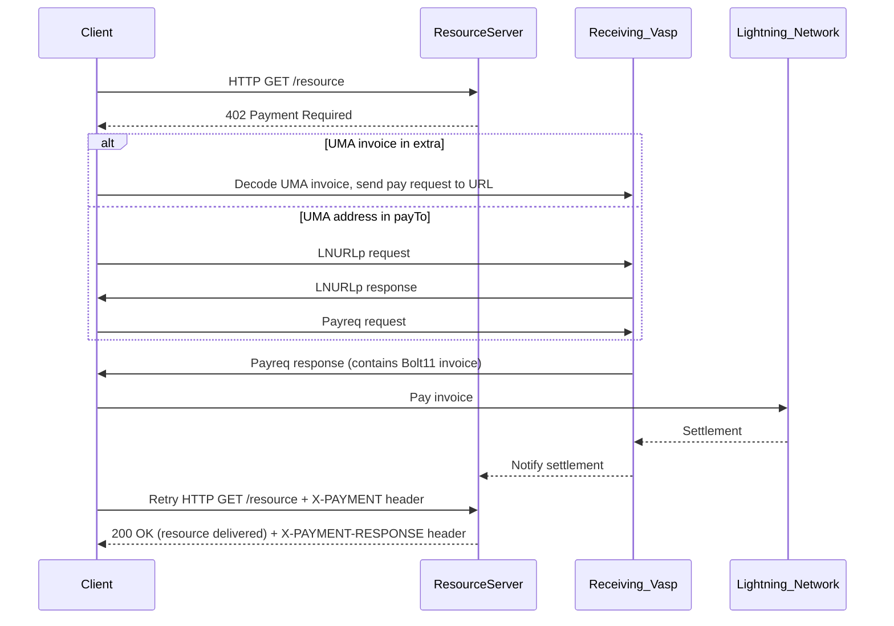

# Exact Payment Scheme for UMA

This document specifies the `exact` payment scheme for the x402 protocol on UMA.

This scheme facilitates payments of a specific amount over Bitcoin using UMA, either directly to an UMA or using an UMA invoice.

## Scheme Name

`exact`

## Protocol Flow

1. **Client** makes an HTTP request to a **Resource Server**.  
2. **Resource Server** responds with a `402 Payment Required` status. The response body contains the `paymentRequirements` for the `exact` scheme  
   - In addition, the `extra` field in the requirements may contain an UMA invoice which resolves to the UMA specified in `payTo`.  
3. **Client** proceeds with one of: (1) directly sending an LNURLp request to the **UMA address** in the payTo field, or (2) decoding the **UMA invoice** and sending a pay request to the url specified.   
4. **Client** completes UMA handshake, and makes payment.  
5. **Client** sends a new HTTP request to the resource server with the `X-PAYMENT` header containing the details of the payment made.  
6. **Resource Server** receives the request and verifies the payment.  
7. **Resource Server** grants the **Client** access to the resource in its response.

## `PaymentRequirements` for `exact`

In addition to the standard x402 `PaymentRequirements` fields, the `exact` scheme on UMA may contain the encoded UMA invoice inside the `extra` field:

```json
{
  "scheme": "exact",
  "network": "uma",
  "maxAmountRequired": "1000", // in lowest denomination of asset
  "asset": "USD",
  "payTo": "$receiver@vasp.com",
  "resource": "https://example.com/weather",
  "description": "Access to protected content",
  "mimeType": "application/json",  
  "maxTimeoutSeconds": 300,
  "extra": {
    "umaInvoice": "uma.." // optional, encoded bech-32 format
  }
}
```

## `X-PAYMENT` Header Payload

The `X-PAYMENT` header is base64 encoded and sent in the request from the client to the resource server when paying for a resource.

Once decoded, the `X-PAYMENT` header is a JSON string with the following properties:

```json
{
 "x402Version": 1,
 "scheme": "exact",
 "network": "uma",
 "payload": {
   "preimage": "..."
 }
}
```

The `payload` field contains the preimage, which serves as the proof of payment for the Lightning payment.

## `X-PAYMENT-RESPONSE` Header Payload

The `X-PAYMENT-RESPONSE` header is base64 encoded and returned to the client from the resource server.

Once decoded, the `X-PAYMENT-RESPONSE` is a JSON string with the following properties:

```json
{
 "success": true | false
 "network": "uma"
}
```

## Sequence Diagram


