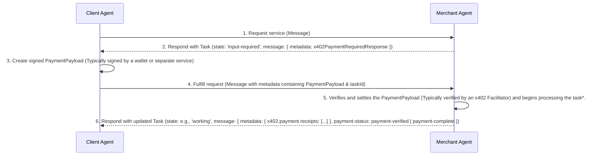
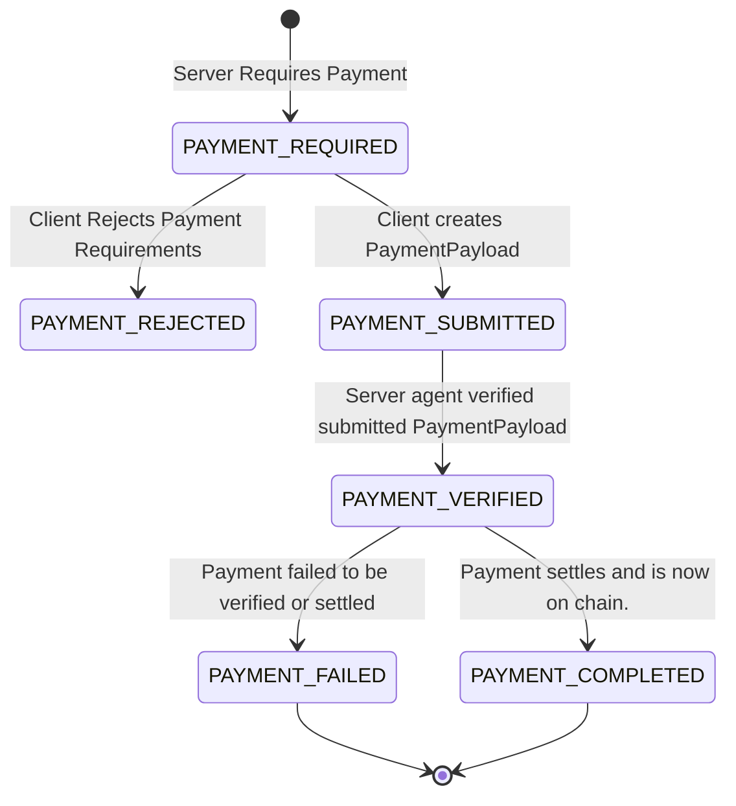

# **A2A Protocol: x402 Payments Extension v0.1**

## **1\. Abstract**

The x402 Payments Extension is an **Extension** for the Agent-to-Agent (A2A) protocol. It enables agents to monetize services through on-chain cryptocurrency payments, reviving the spirit of the HTTP 402 "Payment Required" status code for the world of decentralized agents.

This specification defines the required data structures, message flows, and state machine for requesting, authorizing, and settling payments within the A2A framework. It allows a server agent to require payment for a service, a client agent to authorize that payment using a secure wallet, and the server to verify and settle the transaction on a blockchain network.

## **2\. Extension URI**

The canonical URI for this version of the extension is: https://github.com/google-a2a/a2a-x402/v0.1

Implementations of this extension MUST use this URI for declaration and activation.

## **3\. Extension Declaration**

Agents that support this extension MUST declare it in the `extensions` array of their `AgentCard`.

```
{
  "capabilities": {
    "extensions": [
      {
        "uri": "https://github.com/google-a2a/a2a-x402/v0.1",
        "description": "Supports payments using the x402 protocol for on-chain settlement.",
        "required": true,
      }
    ]
  }
}

```

### **3.1. Required Extension**

Setting `required: true` is recommended. This signals to clients that they **MUST** understand and implement the x402 protocol to interact with the agent's monetized skills. If a required extension is not activated by the client, the agent should reject the request.

## **4\. Payment Protocol Flow**

This x402 extension represents the payment lifecycle using two layers of state: the high-level [A2A Task state](https://a2a-protocol.org/latest/specification/#63-taskstate-enum) (e.g., `input-required`, `completed`) and a more granular `x402.payment.status` metadata field in the [A2A Message object](https://a2a-protocol.org/dev/specification/#64-message-object) that offers a detailed view of the payment process. The flow involves a **Client Agent** (acting on behalf of a user/client) that orchestrates interactions between a **Merchant Agent** (selling a service).

### **4.1. Roles & Responsibilities**

The x402 payment protocol defines the interactions between four distinct architectural roles. While a single application might combine some of these functions (e.g., a Client Agent with an integrated Signing Service), understanding their logical separation is key to a secure and correct implementation.

---

#### Client Agent
The Client Agent acts on behalf of a user, orchestrating the payment flow.

* **Initiates** service requests to the Merchant Agent.
* **Receives** a `Task` that requires payment and processes the `x402PaymentRequiredResponse`.
  * The agent first extracts the list of accepted `PaymentRequirements` from the response.
  * It then determines whether to proceed with payment based on the terms (e.g., cost, asset, network).
    * If accepting, the agent selects a preferred `PaymentRequirements` option and has it signed by a designated signing service or wallet. This service securely signs the object to create the `PaymentPayload`.
    * If rejecting, the agent responds to the Merchant Agent with a `x402.payment.status` of `payment-rejected`.
* **Submits** the signed payment authorization, packaged as an `PaymentPayload`, back to the Merchant Agent, ensuring the `taskId` is included to correlate the payment with the original request.
* **Waits for and processes** the final `Task` from the Merchant Agent, which contains either the completed service result or a payment failure notice.

---

#### Merchant Agent
The Merchant Agent is a specialist agent that provides a monetized skill or service.

* **Determines** when a service request requires payment and responds with an `input-required` `Task` containing a list of accepted payment requirements.
* **Receives** the correlated payment submission from the Client Agent.
* **Communicates** with a type of facilitator to first verify the payment's signature and validity, and then to settle the transaction on-chain.
* **Concludes** the flow by returning a final `Task` to the Client Agent, containing the service result as an `Artifact` and the settlement details in a payment `receipt`.

**Note:** The Merchant Agent is responsible for state management, using the `taskId` to track the payment lifecycle. When it receives a payment submission, it uses the `taskId` to retrieve the original `PaymentRequirements` offered for that task. This allows the agent to validate that the signed `PaymentPayload` corresponds to a valid payment option it previously sent.


### **4.2. Architecture**



* The Merchant Agent SHOULD ensure that the requested work is completed before settling the payment

### **4.3. Step 1: Payment Request (Merchant → Client)**

When a Client Agent requests a service, the Merchant Agent determines that payment is required. It creates a `Task`, sets its status to `input-required`, and includes the `x402PaymentRequiredResponse` object in the `metadata` of the `Task`'s `message`. This `Task` is sent back to the Client Agent.

**Task State:** `input-required` 

**Task Message Metadata:** `x402.payment.status: "payment-required"`, `x402.payment.required: { ... }`

```
/* Response from Merchant Agent to Client Agent */
{
  "jsonrpc": "2.0",
  "id": "req-001",
  "result": {
    "kind": "task",
    "id": "task-123",
    "status": {
      "state": "input-required",
      "message": {
        "kind": "message",
        "role": "agent",
        "parts": [
          { "kind": "text", "text": "Payment is required to generate the image." }
        ],
        "metadata": {
          "x402.payment.status": "payment-required",
          "x402.payment.required": {
            "x402Version": 1,
            "accepts": [{
              "scheme": "exact",
              "network": "base",
              "resource": "https://api.example.com/generate-image",
              "description": "Generate an image",
              "mimeType": "application/json",
              "outputSchema": {},
              "asset": "0x833589fCD6eDb6E08f4c7C32D4f71b54bda02913",
              "payTo": "0xServerWalletAddressHere",
              "maxAmountRequired": "48240000",
              "maxTimeoutSeconds": 600,
              "extra": {
                "name": "USD Coin",
                "version": 2
              }
            }]
          }
        }
      }
    }
  }
}
```

### **4.4. Step 2: Payment Authorization (Client → Wallet → Client)**

The Client Agent receives the `Task` and must determine how to proceed:

1. **Client selects the preferred Payment Requirements:** The Client Agent extracts the `x402PaymentRequiredResponse` object from the task's message metadata, finds the preferred payment requirement object to sign and creates a `PaymentPayload` by signing the payment requirements via its wallet or preffered signing service.

2. **Client Rejects `PaymentRequirements`:** The client rejects all `PaymentRequirements` options and responds to the server agent with a message setting the message metadata field `x402.payment.status` to `payment-rejected`.

### **4.5. Step 3: Fulfill and Settle (Client → Merchant → Client)**

**Client relays signed payload to Merchant:** The Client Agent prepares the signed payload and sends it back to the Merchant Agent in the `metadata` of a new `Message`. This message **MUST** include the `taskId` from the original payment request so the Merchant can correlate the payment to the correct service.

```
/* Request from Client Agent to Merchant Agent */
{
  "jsonrpc": "2.0",
  "method": "message/send",
  "id": "req-003",
  "params": {
    "message": {
      "taskId": "task-123", /* <-- CRITICAL: Links to the original request */
      "role": "user",
      "parts": [
        { "kind": "text", "text": "Here is the payment authorization." }
      ],
      "metadata": {
        "x402.payment.status": "payment-submitted",
        "x402.payment.payload": { /* ... The signed objects from the Client as a PaymentPayload  ... */ }
      }
    }
  }
}
```

**Merchant verifies, settles, and completes:** The Merchant receives the signed payload, verifies it, and settles the payment on-chain. It updates the original `Task`'s `x402.payment.status` and includes the `x402PaymentReceipt` in the task's message `metadata`.  

**Task State:** `input-required` → `completed` | `working` ... 
The management of intermediate Task states during the payment flow, such as transitioning to working during settlement, is at the discretion of the Merchant Agent's implementation.

**Task Metadata:** `x402.payment.status: "payment-verified"` → `"payment-completed"`

The Agent **MUST** include ALL payment receipts created in the lifetime of a Task in the final TaskStatus.message.

```
/* Payment Completed response from Merchant Agent to Client Agent */
{
  "jsonrpc": "2.0",
  "id": "req-003",
  "result": {
    "kind": "task",
    "id": "task-123",
    "status": {
      "state": "working",
      "message": { 
        "kind": "message",
        "role": "agent",
        "parts": [{ "kind": "text", "text": "Payment successful. Your image is ready." }],
        "metadata": {
          "x402.payment.status": "payment-completed",
          "x402.payment.receipts": [{
            "success": true,
            "transaction": "0xabc123...",
            "network": "base",
            "payer": "0xpayerAddress"
          }]
        }
      }
    },
    "artifacts": [ /* ... service result ... */ ],
  }
}
```

Note: The Task state may be working if the payment is complete but the primary Artifact is still being generated. The Task will transition to completed in a subsequent update.

## **5\. Data Structures**

### **5.1. `x402PaymentRequiredResponse`**

Sent by the Merchant Agent in the `metadata` of a `Task` to request payment.

| Field | Type | Required | Description |
| ----- | ----- | ----- | ----- |
| `x402Version` | number | Yes | The version of the x402 protocol being used (e.g., 1). |
| `accepts` | `PaymentRequirements[]` | Yes | An array of accepted payment options. The client can choose any one. |

### **5.2. `PaymentRequirements`**

Describes a single way a client can pay.

| Field | Type | Required | Description |
| ----- | ----- | ----- | ----- |
| `scheme` | string | Yes | The payment scheme (e.g., "exact"). |
| `network` | string | Yes | The blockchain network identifier (e.g., "base"). |
| `asset` | string | Yes | The contract address of the token to be paid. |
| `payTo` | string | Yes | The recipient's wallet address. |
| `maxAmountRequired` | string | Yes | The required payment amount in the token's smallest unit (e.g., wei). |
| `resource` | string | No | A unique identifier for the resource being purchased. |
| `description` | string | No | A human-readable description of the payment. |
| `maxTimeoutSeconds` | number | No | The number of seconds the payment requirements are valid for. |
| `extra` | object | No | A container for additional scheme-specific data (e.g., EIP-712 domain info). |

### **5.3. `PaymentPayload`**

Created by the Signing Service, containing the signed payment authorization.

| Field | Type | Required | Description |
| ----- | ----- | ----- | ----- |
| `x402Version` | number | Yes | The version of the x402 protocol being used. |
| `network` | string | Yes | The blockchain network for the payment. |
| `scheme` | string | Yes | The payment scheme being used. |
| `payload` | object | Yes | The signed payment details, specific to the scheme. |

### **5.4. `x402SettleResponse`**

Returned by the Merchant Agent in `Task`'s `Message` metadata after a successful payment.

| Field | Type | Required | Description |
| ----- | ----- | ----- | ----- |
| `success` | bool | Yes | Status of the transaction settlement |
| `errorReason` | string | No | Error reason for unsuccessful settlement |
| `transaction` | string | No | The on-chain transaction hash of the settled payment. Present only if `success` is true. |
| `network` | string | Yes | The network where the payment was settled. |
| `payer` | string | No | The payer of the settled transaction |

## **6\. Metadata and State Management**

This extension uses the `metadata` field on the `Message` objects to track the payment state and transport data.

* `x402.payment.status`: The current stage of the payment flow. Values:   
  * `"payment-required"`: Payment requirements have been sent to client agent  
  * `"payment-submitted"`: Payment payload has been received by the server agent
  * `"payment-rejected"`: Payment requirements have been rejected by the client
  * `"payment-verified"`: Payment payload has been sent to verified by the server agent  
  * `"payment-completed"`: Payment transaction has been settled by the server agent  
  * `"payment-failed"`: Payment payload failed to be verified, settled, or posted on-chain successfully.  
* `x402.payment.required`: Contains the `x402PaymentRequiredResponse` object sent from the Merchant.  
* `x402.payment.payload`: Contains the `PaymentPayload` object with the signed authorization from the signing service.  
* `x402.payment.receipts`: A persistent array containing the complete history of all x402SettleResponse objects for the task. Each new settlement attempt (successful or failed) MUST be appended to this array, never replacing it. 
* `x402.payment.error`: In case of failure, a short error code (e.g., `"insufficient_funds"`).

### **6.1. State Transitions**



## **7\. Extension Activation**

Clients MUST request activation of this extension by including its URI in the `X-A2A-Extensions` HTTP header.

`X-A2A-Extensions: https://github.com/google-a2a/a2a-x402/v0.1`

The server agent MUST echo the URI in the response header to confirm activation.

## **8\. Error Handling**

If a payment fails, the server MUST set the `x402.payment.status` to `payment-failed` and provide a reason in the `TaskStatus` message and `metadata`.
The management of Task states at payment failure is at the discretion of the Merchant Agent's implementation. For example the agent could leave the Task state as working or request a payment requirement with `input-required` again.

### **8.1. Common Error Codes**

| Code | Description |
| ----- | ----- |
| `INSUFFICIENT_FUNDS` | The client's wallet has insufficient funds to cover the payment. |
| `INVALID_SIGNATURE` | The payment authorization signature could not be verified. |
| `EXPIRED_PAYMENT` | The payment authorization was submitted after its expiry time. |
| `DUPLICATE_NONCE` | The nonce for this payment has already been used. |
| `NETWORK_MISMATCH` | The payment was signed for a different blockchain network. |
| `INVALID_AMOUNT` | The payment amount does not match the required amount. |
| `SETTLEMENT_FAILED` | The transaction failed on-chain for a reason other than the above. |

### **8.2. Example Error Response**

```
{
  "kind": "task",
  "id": "task-123",
  "status": {
    "state": "failed",
    "message": {
      "kind": "message",
      "role": "agent",
      "parts": [{ "kind": "text", "text": "Payment verification failed: The signature has expired." }],
      "metadata": {
        "x402.payment.status": "payment-failed",
        "x402.payment.error": "EXPIRED_PAYMENT",
        "x402.payment.receipts": [{
            "success": false,
            "errorReason": "Payment authorization was submitted after its 'validBefore' timestamp.",
            "network": "base",
        "transaction": ""
        }]
      }
    }
  }
}

```

## **9\. Security Considerations**

* **Private Key Security**: Private keys MUST only be handled by trusted entities and never be handled directly by any LLM operating an agent.
* **Signature Verification**: Server agents MUST cryptographically verify every payment signature before attempting settlement.  
* **Input Validation**: Servers MUST rigorously validate the contents of all payment-related data structures.  
* **Replay Protection**: Servers MUST track used nonces to prevent replay attacks.  
* **Transport Security**: All A2A communication MUST use a secure transport layer like HTTPS/TLS

## **10\. References**

* [**A2A Protocol Specification**](https://a2a-protocol.org/latest/specification): The core Agent-to-Agent protocol specification, defining the base data structures and methods that this extension builds upon.  
* [**A2A Extensions Documentation**](https://github.com/a2aproject/A2A/blob/main/docs/topics/extensions.md): The official documentation on how to create and use extensions within the A2A protocol.  
* [**x402 Protocol Specification**](https://x402.gitbook.io/x402): The underlying x402 payments protocol specification that provides the conceptual framework for this A2A extension.