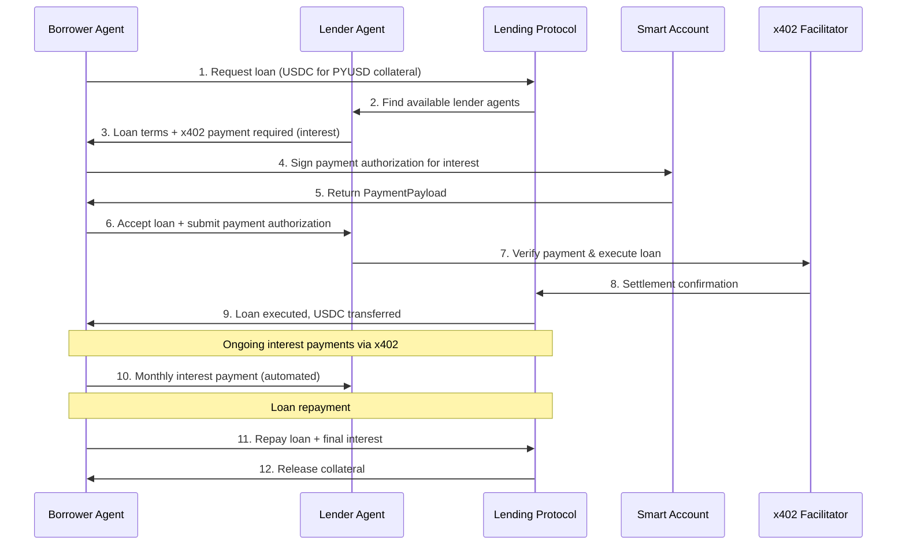

# **Orbital Protocol - A2A Overcollateralized Lending Platform MCP Specification**

## **1. EXECUTIVE SUMMARY**

This MCP defines the complete architecture, rules, and specifications for building a revolutionary **Agent-to-Agent (A2A) Overcollateralized Lending Protocol** with Smart Account integration and x402 payment rails. The system enables autonomous agents to lend, borrow, and arbitrage across multiple DeFi protocols (AAVE, Compound, etc.) while providing seamless stablecoin-to-stablecoin lending (USDC ↔ PYUSD) with intelligent risk management.

**Core Innovation**: The first A2A lending protocol that combines:
- **Smart Account Architecture** for autonomous agent operations
- **x402 Payment Integration** for seamless cross-protocol transactions  
- **Multi-Protocol Arbitrage** across AAVE, Compound, and other lending platforms
- **Overcollateralized Lending** with dynamic risk assessment
- **Cross-Stablecoin Liquidity** enabling USDC/PYUSD and other stable pair lending

## **2. SYSTEM ARCHITECTURE OVERVIEW**

### **2.1 A2A Lending Protocol Architecture**

```
┌─────────────────────────────────────────────────────────────┐
│                     AGENT INTERFACE LAYER                  │
├─────────────────────────────────────────────────────────────┤
│  A2A Lending UI    │  Agent Dashboard      │  Risk Monitor  │
├─────────────────────────────────────────────────────────────┤
│                      API GATEWAY LAYER                     │
├─────────────────────────────────────────────────────────────┤
│  Lending API       │  x402 Payment API     │  Analytics API │
├─────────────────────────────────────────────────────────────┤
│                     AGENT ORCHESTRATION LAYER              │
├─────────────────────────────────────────────────────────────┤
│  Lending Agents    │  Arbitrage Agents     │  Risk Agents   │
├─────────────────────────────────────────────────────────────┤
│                     SMART ACCOUNT LAYER                    │
├─────────────────────────────────────────────────────────────┤
│  ERC-4337 Accounts │  Agent Wallets        │  Multi-Sig     │
├─────────────────────────────────────────────────────────────┤
│                     PROTOCOL INTEGRATION LAYER             │
├─────────────────────────────────────────────────────────────┤
│  AAVE Integration  │  Compound Integration │  Flash Loans   │
├─────────────────────────────────────────────────────────────┤
│                     BLOCKCHAIN LAYER                       │
├─────────────────────────────────────────────────────────────┤
│  Lending Contracts │  Collateral Manager   │  Liquidator    │
├─────────────────────────────────────────────────────────────┤
│                     INFRASTRUCTURE LAYER                   │
├─────────────────────────────────────────────────────────────┤
│  Multi-Chain RPC   │  Price Oracles        │  Risk Engine   │
└─────────────────────────────────────────────────────────────┘
```

### **2.2 Technology Stack Requirements**

**Core Infrastructure**:
- **Blockchain**: Arbitrum, Ethereum Mainnet, Base (multi-chain support)
- **Smart Contracts**: Solidity 0.8.30, Foundry framework
- **Smart Accounts**: ERC-4337 Account Abstraction, Biconomy/Alchemy AA
- **Backend API**: Python Flask with Web3.py and lending protocol integrations

**Agent Framework**:
- **A2A Protocol**: Agent-to-Agent communication with x402 payments
- **Agent Runtime**: Python-based autonomous agent framework
- **Risk Engine**: Real-time collateralization and liquidation monitoring
- **Arbitrage Engine**: Cross-protocol rate optimization

**DeFi Integration**:
- **AAVE Protocol**: Lending, borrowing, and flash loan integration
- **Compound Protocol**: Alternative lending markets
- **Chainlink Oracles**: Price feeds for accurate collateral valuation
- **1inch/0x**: DEX aggregation for liquidations

**Frontend & Analytics**:
- **Frontend**: Next.js 15.4.4 with TypeScript, agent dashboard
- **Indexing**: The Graph Protocol with multi-protocol subgraphs
- **Payment Protocol**: A2A x402 extension v0.1
- **State Management**: TanStack React Query with real-time updates

## **3. SMART CONTRACT ARCHITECTURE**

### **3.1 Core Contract: OrbitalLendingProtocol.sol**

**REVOLUTIONARY LENDING MODEL**: The Orbital Lending Protocol implements an overcollateralized lending system with A2A agent integration:

#### **3.1.1 Lending Foundation**
- **Overcollateralization**: Dynamic collateral ratios based on asset volatility (150%-300%)
- **Multi-Asset Support**: USDC, PYUSD, USDT, DAI, and other major stablecoins
- **Smart Account Integration**: ERC-4337 compatible for agent operations
- **Cross-Protocol Arbitrage**: Automated rate optimization across AAVE, Compound, etc.

#### **3.1.2 Contract Structure Requirements**

```solidity
// A2A Overcollateralized Lending Protocol
contract OrbitalLendingProtocol {
    // Core State Variables
    mapping(address => mapping(address => LoanPosition)) public loans; // user => asset => position
    mapping(address => AssetConfiguration) public supportedAssets; // Supported lending assets
    mapping(address => AgentConfiguration) public registeredAgents; // A2A agents
    mapping(bytes32 => ArbitrageOpportunity) public activeArbitrage; // Cross-protocol opportunities
    
    IAAVELendingPool public immutable AAVE_POOL;
    ICompoundComptroller public immutable COMPOUND_COMPTROLLER;
    IAccountAbstractionFactory public immutable AA_FACTORY;
    IPriceOracle public immutable PRICE_ORACLE;
    
    // Loan Position Structure (CRITICAL)
    struct LoanPosition {
        uint256 collateralAmount;    // Collateral deposited
        uint256 borrowedAmount;      // Amount borrowed
        uint256 liquidationPrice;    // Price trigger for liquidation
        uint256 interestRate;        // Current interest rate
        uint256 lastUpdateTimestamp; // Last interest calculation
        address collateralAsset;     // Collateral token address
        address borrowedAsset;       // Borrowed token address
        LoanStatus status;           // Active, Liquidated, Repaid
        address agentLender;         // A2A agent providing the loan
    }
    
    // Asset Configuration
    struct AssetConfiguration {
        uint256 collateralFactor;    // Max LTV ratio (e.g., 75% = 7500)
        uint256 liquidationThreshold; // Liquidation trigger (e.g., 85% = 8500)
        uint256 liquidationPenalty;  // Penalty fee (e.g., 5% = 500)
        uint256 baseInterestRate;    // Base lending APR
        uint256 slope1;              // Interest rate slope 1
        uint256 slope2;              // Interest rate slope 2
        uint256 optimalUtilization;  // Optimal utilization rate
        bool isActive;               // Asset is active for lending
        uint256 supplyCap;           // Maximum supply allowed
        uint256 borrowCap;           // Maximum borrow allowed
    }
    
    // Agent Configuration for A2A
    struct AgentConfiguration {
        address agentSmartAccount;   // ERC-4337 smart account
        uint256 creditScore;         // Agent credit rating (0-1000)
        uint256 totalLent;           // Total amount lent by agent
        uint256 totalBorrowed;       // Total borrowed by agent
        uint256 successfulLoans;     // Number of successful loans
        uint256 defaultedLoans;      // Number of defaults
        bool isActive;               // Agent is active
        bytes32[] strategies;        // Available lending strategies
    }
    
    // Cross-Protocol Arbitrage Opportunity
    struct ArbitrageOpportunity {
        address sourceProtocol;      // Protocol to borrow from (AAVE/Compound)
        address targetProtocol;      // Protocol to lend to
        address asset;               // Asset for arbitrage
        uint256 sourceRate;          // Borrow rate at source
        uint256 targetRate;          // Lend rate at target
        uint256 profitMargin;        // Expected profit margin
        uint256 maxAmount;           // Maximum arbitrage amount
        uint256 expiryTimestamp;     // Opportunity expiry
    }
}
```

#### **3.1.3 Critical Functions Implementation**

**CORE LENDING FUNCTIONS**:
1. `createLoan(address collateralAsset, address borrowAsset, uint256 collateralAmount, uint256 borrowAmount)` - Create overcollateralized loan
2. `repayLoan(address borrowAsset, uint256 repayAmount)` - Repay loan with interest
3. `liquidateLoan(address borrower, address borrowAsset)` - Liquidate undercollateralized position
4. `agentLend(address borrower, address asset, uint256 amount, uint256 interestRate)` - A2A agent lending
5. `flashLoanArbitrage(address asset, uint256 amount, bytes calldata params)` - Cross-protocol arbitrage
6. `updateCollateral(address asset, uint256 additionalCollateral)` - Add collateral to existing loan

**AGENT MANAGEMENT FUNCTIONS**:
1. `registerAgent(address smartAccount, bytes32[] strategies)` - Register A2A lending agent
2. `updateAgentStrategy(bytes32 strategyId, uint256 maxLoanAmount, uint256 preferredRate)` - Update agent parameters
3. `getOptimalRate(address asset, uint256 amount)` - Calculate optimal lending rate across protocols
4. `executeArbitrage(bytes32 opportunityId, uint256 amount)` - Execute cross-protocol arbitrage

**RISK MANAGEMENT FUNCTIONS**:
1. `calculateHealthFactor(address user, address asset)` - Calculate loan health ratio
2. `getValidationPrice(address asset)` - Get current asset price from oracle
3. `checkLiquidationThreshold(address user, address asset)` - Check if position needs liquidation
4. `emergencyPause(bool pauseState)` - Emergency protocol pause

### **3.2 Agent Factory Contract: OrbitalAgentFactory.sol**

```solidity
contract OrbitalAgentFactory {
    address public immutable LENDING_PROTOCOL; // Main lending protocol
    address public immutable AA_FACTORY; // Account Abstraction factory
    address[] public deployedAgents; // All deployed agent accounts
    mapping(address => AgentDeploymentInfo) public agentInfo; // Agent metadata
    
    struct AgentDeploymentInfo {
        address owner; // Agent owner
        address smartAccount; // ERC-4337 smart account
        bytes32[] strategies; // Enabled strategies
        uint256 deploymentTimestamp;
        AgentType agentType;
    }
    
    enum AgentType {
        LENDER, // Provides liquidity for lending
        BORROWER, // Borrows against collateral
        ARBITRAGE, // Cross-protocol arbitrage
        LIQUIDATOR, // Liquidates unhealthy positions
        RISK_MANAGER // Risk assessment and monitoring
    }
    
    // MUST EMIT
    event AgentDeployed(
        address indexed owner,
        address indexed smartAccount, 
        AgentType agentType,
        bytes32[] strategies
    );
    
    event AgentStrategyUpdated(
        address indexed smartAccount,
        bytes32 strategy,
        bool enabled
    );
    
    function deployLendingAgent(
        bytes32[] memory strategies,
        uint256 initialDeposit
    ) external returns (address smartAccount);
    
    function deployArbitrageAgent(
        address[] memory protocols,
        uint256 maxTradeSize
    ) external returns (address smartAccount);
    
    function getAgentCount() external view returns (uint256);
    function getAllAgents() external view returns (address[] memory);
}
```

### **3.3 Risk Engine Contract (Rust/Stylus)**

**CRITICAL**: Must be deployed as Stylus contract for gas-efficient risk calculations

**Required Functions**:
```rust
impl IOrbitalRiskEngine {
    // Interest Rate Calculations
    fn calculate_utilization_rate(total_borrows: u256, total_supply: u256) -> u256;
    fn calculate_borrow_rate(utilization_rate: u256, base_rate: u256, slope1: u256, slope2: u256, optimal_utilization: u256) -> u256;
    fn calculate_supply_rate(borrow_rate: u256, utilization_rate: u256, reserve_factor: u256) -> u256;
    
    // Health Factor & Liquidation
    fn calculate_health_factor(
        collateral_value_usd: u256,
        borrowed_value_usd: u256,
        liquidation_threshold: u256
    ) -> u256;
    
    fn calculate_liquidation_amount(
        borrowed_amount: u256,
        collateral_amount: u256,
        borrowed_price: u256,
        collateral_price: u256,
        close_factor: u256
    ) -> u256;
    
    // Cross-Protocol Arbitrage Calculations
    fn calculate_arbitrage_profit(
        borrow_rate_source: u256,
        lend_rate_target: u256,
        amount: u256,
        gas_cost: u256,
        time_period: u256
    ) -> i256;
    
    fn optimal_arbitrage_amount(
        source_liquidity: u256,
        target_liquidity: u256,
        rate_difference: u256,
        max_position_size: u256
    ) -> u256;
    
    // Agent Credit Scoring
    fn calculate_agent_credit_score(
        successful_loans: u256,
        total_loans: u256,
        total_volume: u256,
        time_since_registration: u256,
        default_count: u256
    ) -> u256;
    
    // Flash Loan Calculations  
    fn calculate_flash_loan_fee(amount: u256, fee_rate: u256) -> u256;
    fn validate_flash_loan_callback(
        initial_balance: u256,
        final_balance: u256,
        loan_amount: u256,
        fee: u256
    ) -> bool;
}
```

### **3.4 Protocol Integration Contracts**

#### **3.4.1 AAVE Integration Contract**
```solidity
contract AAVEIntegration {
    ILendingPool public immutable AAVE_LENDING_POOL;
    IProtocolDataProvider public immutable AAVE_DATA_PROVIDER;
    
    function depositToAAVE(address asset, uint256 amount) external;
    function borrowFromAAVE(address asset, uint256 amount, uint256 interestRateMode) external;
    function repayAAVE(address asset, uint256 amount, uint256 rateMode) external;
    function flashLoanAAVE(address asset, uint256 amount, bytes calldata params) external;
    function getAAVESupplyRate(address asset) external view returns (uint256);
    function getAAVEBorrowRate(address asset) external view returns (uint256);
}
```

#### **3.4.2 Compound Integration Contract**
```solidity
contract CompoundIntegration {
    IComptroller public immutable COMPOUND_COMPTROLLER;
    mapping(address => ICToken) public cTokens;
    
    function supplyToCompound(address asset, uint256 amount) external;
    function borrowFromCompound(address asset, uint256 amount) external;
    function repayCompound(address asset, uint256 amount) external;
    function getCompoundSupplyRate(address asset) external view returns (uint256);
    function getCompoundBorrowRate(address asset) external view returns (uint256);
}
```

### **3.5 Deployment Architecture**

**Deployment Order (CRITICAL)**:
1. Deploy Risk Engine (Rust/Stylus)
2. Deploy Price Oracle contracts
3. Deploy AAVE/Compound integration contracts
4. Deploy main OrbitalLendingProtocol
5. Deploy OrbitalAgentFactory
6. Initialize supported assets and configurations
7. Deploy initial agent smart accounts

**Foundry Configuration**:
```toml
[profile.default]
src = "src"
out = "out" 
libs = ["lib"]
via_ir = true # REQUIRED for complex risk calculations
optimizer = true
optimizer_runs = 200

[dependencies]
forge-std = { git = "https://github.com/foundry-rs/forge-std", tag = "v1.5.3" }
openzeppelin-contracts = { git = "https://github.com/OpenZeppelin/openzeppelin-contracts", tag = "v4.9.0" }
aave-v3-core = { git = "https://github.com/aave/aave-v3-core", tag = "v1.17.2" }
compound-protocol = { git = "https://github.com/compound-finance/compound-protocol", tag = "v2.8.1" }
account-abstraction = { git = "https://github.com/eth-infinitism/account-abstraction", tag = "v0.6.0" }
```

## **4. API LAYER ARCHITECTURE**

### **4.1 Flask REST API (api/app.py)**

**Core Lending API Endpoints**:

```python
# Configuration (MUST BE ENVIRONMENT DRIVEN)
RPC_URL = os.getenv('RPC_URL', "https://arbitrum-mainnet.infura.io/v3/...")
CHAIN_ID = int(os.getenv('CHAIN_ID', '42161'))  # Arbitrum mainnet
LENDING_PROTOCOL_ADDRESS = os.getenv('LENDING_PROTOCOL_ADDRESS')
AAVE_POOL_ADDRESS = os.getenv('AAVE_POOL_ADDRESS', "0x794a61358D6845594F94dc1DB02A252b5b4814aD")
COMPOUND_COMPTROLLER = os.getenv('COMPOUND_COMPTROLLER', "0x3d9819210A31b4961b30EF54bE2aeD79B9c9Cd3B")

# Supported Lending Assets
LENDING_ASSETS = {
    "USDC": {
        "address": "0xA0b86991c431C924b563B9C7C85b8E44a4C9c53C7",
        "decimals": 6,
        "collateral_factor": 8500,  # 85%
        "liquidation_threshold": 9000,  # 90%
        "oracle": "0x8fFfFfd4AfB6115b954Bd326cbe7B4BA576818f6"
    },
    "PYUSD": {
        "address": "0x6c3ea9036406852006290770BEdFcAbA0e23A0e8",
        "decimals": 6,
        "collateral_factor": 8000,  # 80%
        "liquidation_threshold": 8500,  # 85%
        "oracle": "0x8f1df6d7f2db73eece86a18b4381f4707b918fb1"
    },
    "USDT": {
        "address": "0xdAC17F958D2ee523a2206206994597C13D831ec7",
        "decimals": 6,
        "collateral_factor": 8200,  # 82%
        "liquidation_threshold": 8700,  # 87%
        "oracle": "0x3E7d1eAB13ad0104d2750B8863b489D65364e32D"
    },
    "DAI": {
        "address": "0x6B175474E89094C44Da98b954EedeAC495271d0F",
        "decimals": 18,
        "collateral_factor": 8300,  # 83%
        "liquidation_threshold": 8800,  # 88%
        "oracle": "0xaed0c38402a5d19df6e4c03f4e2dced6e29c1ee9"
    }
}

# MANDATORY LENDING ENDPOINTS
@app.route('/lending/create-loan', methods=['POST'])          # Create overcollateralized loan
@app.route('/lending/repay-loan', methods=['POST'])           # Repay loan with interest
@app.route('/lending/add-collateral', methods=['POST'])       # Add additional collateral
@app.route('/lending/liquidate', methods=['POST'])            # Liquidate unhealthy position
@app.route('/lending/health-factor', methods=['GET'])         # Get loan health factor
@app.route('/lending/user-positions', methods=['GET'])        # Get user's loan positions

# A2A AGENT ENDPOINTS  
@app.route('/agents/register', methods=['POST'])              # Register new lending agent
@app.route('/agents/lend', methods=['POST'])                  # Agent-to-agent lending
@app.route('/agents/strategies', methods=['GET'])             # Get available strategies
@app.route('/agents/performance', methods=['GET'])            # Agent performance metrics

# ARBITRAGE ENDPOINTS
@app.route('/arbitrage/opportunities', methods=['GET'])       # Get cross-protocol opportunities
@app.route('/arbitrage/execute', methods=['POST'])            # Execute arbitrage trade
@app.route('/arbitrage/flash-loan', methods=['POST'])         # Flash loan arbitrage

# PROTOCOL INTEGRATION ENDPOINTS
@app.route('/protocols/aave/rates', methods=['GET'])          # AAVE current rates
@app.route('/protocols/compound/rates', methods=['GET'])      # Compound current rates
@app.route('/protocols/optimal-rate', methods=['GET'])        # Best rate across protocols

# ANALYTICS ENDPOINTS
@app.route('/analytics/tvl', methods=['GET'])                 # Total Value Locked
@app.route('/analytics/volume', methods=['GET'])              # Lending/borrowing volume
@app.route('/analytics/liquidations', methods=['GET'])        # Liquidation events
@app.route('/analytics/agent-performance', methods=['GET'])   # Agent performance stats
```

### **4.2 Agent Orchestration Service**

**File**: `api/services/agent_orchestrator.py`

```python
class OrbitalAgentOrchestrator:
    def __init__(self):
        self.lending_protocol = os.getenv('LENDING_PROTOCOL_ADDRESS')
        self.aave_client = AAVEClient()
        self.compound_client = CompoundClient()
        self.risk_engine = RiskEngine()
        
    # AGENT MANAGEMENT
    def register_agent(self, agent_config: AgentConfig) -> Dict
    def deploy_smart_account(self, owner: str, agent_type: AgentType) -> str
    def update_agent_strategy(self, agent_address: str, strategy: Strategy) -> bool
    
    # LENDING OPERATIONS  
    def execute_agent_loan(self, lender_agent: str, borrower: str, loan_params: LoanParams) -> Dict
    def monitor_loan_health(self, loan_id: str) -> HealthReport
    def trigger_liquidation(self, loan_id: str, liquidator_agent: str) -> Dict
    
    # ARBITRAGE OPERATIONS
    def scan_arbitrage_opportunities(self) -> List[ArbitrageOpportunity]
    def execute_cross_protocol_arbitrage(self, opportunity_id: str, agent: str) -> Dict
    def calculate_optimal_arbitrage_size(self, opportunity: ArbitrageOpportunity) -> int
    
    # RISK MANAGEMENT
    def calculate_portfolio_risk(self, agent_address: str) -> RiskMetrics
    def get_collateralization_ratio(self, loan_id: str) -> float
    def predict_liquidation_probability(self, loan_id: str) -> float
```

### **4.3 Protocol Integration Services**

**File**: `api/services/protocol_integrations.py`

```python
class AAVEClient:
    def __init__(self):
        self.lending_pool = os.getenv('AAVE_LENDING_POOL')
        self.data_provider = os.getenv('AAVE_DATA_PROVIDER')
    
    def get_supply_rate(self, asset: str) -> float
    def get_borrow_rate(self, asset: str, rate_mode: int) -> float
    def get_available_liquidity(self, asset: str) -> int
    def execute_flash_loan(self, asset: str, amount: int, params: bytes) -> Dict

class CompoundClient:
    def __init__(self):
        self.comptroller = os.getenv('COMPOUND_COMPTROLLER')
        
    def get_supply_rate(self, asset: str) -> float
    def get_borrow_rate(self, asset: str) -> float
    def get_cash_balance(self, asset: str) -> int
    def calculate_account_liquidity(self, account: str) -> Dict

class RiskEngine:
    def __init__(self):
        self.price_oracle = os.getenv('CHAINLINK_PRICE_ORACLE')
        
    def calculate_health_factor(self, collateral_usd: float, debt_usd: float, threshold: float) -> float
    def get_asset_price(self, asset: str) -> float
    def calculate_liquidation_price(self, loan_params: LoanParams) -> float
    def assess_credit_risk(self, agent_address: str) -> CreditScore
```

### **4.3 Error Handling Standards**

```python
# Standardized Error Responses
{
    "success": false,
    "error": "ERROR_CODE",
    "message": "Human readable message",
    "details": {
        "transaction_hash": "0x...",
        "gas_used": 123456,
        "block_number": 789
    }
}
```

## **5. SUBGRAPH ARCHITECTURE**

### **5.1 GraphQL Schema (schema.graphql)**

```graphql
# IMMUTABLE ENTITIES (Historical Data)
type LiquidityAdded @entity(immutable: true) {
    id: Bytes!
    provider: Bytes!
    k: BigInt!
    amounts: [BigInt!]!
    lpShares: BigInt!
    blockNumber: BigInt!
    blockTimestamp: BigInt!
    transactionHash: Bytes!
}

type Swap @entity(immutable: true) {
    id: Bytes!
    trader: Bytes!
    tokenIn: BigInt!
    tokenOut: BigInt!
    amountIn: BigInt!
    amountOut: BigInt!
    fee: BigInt!
    blockNumber: BigInt!
    blockTimestamp: BigInt!
    transactionHash: Bytes!
}

type TickStatusChanged @entity(immutable: true) {
    id: Bytes!
    k: BigInt!
    oldStatus: Int!
    newStatus: Int!
    blockNumber: BigInt!
    blockTimestamp: BigInt!
    transactionHash: Bytes!
}

# REQUIRED: Add aggregated entities for analytics
type DailyPoolStats @entity {
    id: ID!
    date: Int!
    volumeUSD: BigDecimal!
    liquidityUSD: BigDecimal!
    swapCount: Int!
}

type TokenDayData @entity {
    id: ID!
    token: Int!
    date: Int!
    volumeUSD: BigDecimal!
    priceUSD: BigDecimal!
}
```

### **5.2 Subgraph Configuration (subgraph.yaml)**

```yaml
specVersion: 1.3.0
indexerHints:
  prune: auto
schema:
  file: ./schema.graphql
dataSources:
  - kind: ethereum
    name: OrbitalPool
    network: arbitrum-sepolia
    source:
      address: "POOL_ADDRESS_PLACEHOLDER"
      abi: OrbitalPool
      startBlock: START_BLOCK_PLACEHOLDER
    mapping:
      kind: ethereum/events
      apiVersion: 0.0.9
      language: wasm/assemblyscript
      entities: [LiquidityAdded, LiquidityRemoved, Swap, TickStatusChanged]
      eventHandlers:
        - event: LiquidityAdded(indexed address,uint256,uint256[5],uint256)
          handler: handleLiquidityAdded
        - event: Swap(indexed address,uint256,uint256,uint256,uint256,uint256)
          handler: handleSwap
```

## **6. A2A X402 PAYMENT INTEGRATION FOR LENDING**

### **6.1 Lending-Specific Protocol Specification**

**Extension URI**: `https://github.com/google-a2a/a2a-x402/v0.1`

**Core Components for Lending**:
1. **Lender Agent**: Provides liquidity and earns interest via x402 payments
2. **Borrower Agent**: Requests loans and pays interest/fees through x402
3. **Liquidator Agent**: Liquidates positions and receives rewards via x402
4. **Arbitrage Agent**: Executes cross-protocol trades and earns profits via x402

### **6.2 Lending Payment Flow Architecture**



### **6.3 Payment Types for Lending Services**

```python
# Lending service payment requirements
LENDING_PAYMENT_SERVICES = {
    "loan_origination": {
        "base_fee": "0.0005", # ETH
        "percentage_fee": "0.001", # 0.1% of loan amount
        "payment_token": "ETH",
        "networks": ["arbitrum", "mainnet", "base"]
    },
    "interest_payments": {
        "base_fee": "0.0001",
        "percentage_fee": "0.0025", # 0.25% service fee on interest
        "payment_token": "borrowed_asset", # Pay interest in borrowed asset
        "frequency": "monthly",
        "networks": ["arbitrum", "mainnet"]
    },
    "liquidation_service": {
        "base_fee": "0.002", # Higher fee for liquidation
        "percentage_fee": "0.05", # 5% of liquidation amount
        "payment_token": "liquidated_collateral",
        "networks": ["arbitrum", "mainnet"]
    },
    "arbitrage_execution": {
        "base_fee": "0.0002",
        "percentage_fee": "0.10", # 10% of arbitrage profit
        "payment_token": "profit_token",
        "networks": ["arbitrum", "mainnet", "base"]
    },
    "risk_assessment": {
        "base_fee": "0.0001",
        "rate_limit": "1000/hour",
        "payment_token": "USDC",
        "networks": ["arbitrum"]
    },
    "flash_loan_service": {
        "base_fee": "0.0005",
        "percentage_fee": "0.0009", # 0.09% flash loan fee
        "payment_token": "flash_loan_asset",
        "networks": ["arbitrum", "mainnet"]
    }
}
```

### **6.4 Lending Agent Implementation**

**Python SDK Integration**:
```python
from x402_a2a import (
    create_payment_requirements,
    require_payment,
    paid_service,
    X402_EXTENSION_URI
)

# MANDATORY: Lending agent card declaration
def create_lending_agent_card(agent_type: str):
    return {
        "capabilities": {
            "extensions": [{
                "uri": X402_EXTENSION_URI,
                "description": f"Supports x402 payments for {agent_type} lending services",
                "required": True
            }]
        },
        "lending_services": {
            "supported_assets": ["USDC", "PYUSD", "USDT", "DAI"],
            "max_loan_amount": "1000000", # $1M max
            "min_collateral_ratio": "150", # 150% minimum
            "supported_protocols": ["AAVE", "Compound"],
            "agent_type": agent_type # "lender", "borrower", "liquidator", "arbitrage"
        }
    }

# Lender Agent Implementation
class LenderAgent:
    def __init__(self, smart_account_address: str):
        self.smart_account = smart_account_address
        self.lending_protocol = OrbitalLendingProtocol()
        
    @paid_service("loan_origination")
    async def provide_loan(self, borrower: str, asset: str, amount: int, collateral_asset: str, collateral_amount: int):
        """Provide overcollateralized loan to borrower"""
        # Verify collateral ratio
        collateral_ratio = self.calculate_collateral_ratio(asset, amount, collateral_asset, collateral_amount)
        if collateral_ratio < 150:  # 150% minimum
            raise InsufficientCollateralError()
            
        # Create loan via smart contract
        loan_id = await self.lending_protocol.create_loan(
            borrower=borrower,
            lender_agent=self.smart_account,
            borrowed_asset=asset,
            borrowed_amount=amount,
            collateral_asset=collateral_asset,
            collateral_amount=collateral_amount,
            interest_rate=self.calculate_optimal_rate(asset, amount)
        )
        
        return {
            "loan_id": loan_id,
            "status": "active",
            "monthly_payment": self.calculate_monthly_payment(amount, interest_rate)
        }

# Arbitrage Agent Implementation  
class ArbitrageAgent:
    def __init__(self, smart_account_address: str):
        self.smart_account = smart_account_address
        self.aave_client = AAVEClient()
        self.compound_client = CompoundClient()
        
    @paid_service("arbitrage_execution")
    async def execute_cross_protocol_arbitrage(self, asset: str, amount: int):
        """Execute arbitrage between AAVE and Compound"""
        aave_rate = await self.aave_client.get_supply_rate(asset)
        compound_rate = await self.compound_client.get_supply_rate(asset)
        
        if aave_rate > compound_rate:
            # Borrow from Compound, lend to AAVE
            profit = await self.execute_arbitrage(
                borrow_protocol="compound",
                lend_protocol="aave", 
                asset=asset,
                amount=amount
            )
        else:
            # Borrow from AAVE, lend to Compound
            profit = await self.execute_arbitrage(
                borrow_protocol="aave",
                lend_protocol="compound",
                asset=asset, 
                amount=amount
            )
            
        return {"profit": profit, "asset": asset, "amount": amount}
```

## **7. FRONTEND ARCHITECTURE**

### **7.1 Next.js Lending Platform Structure**

```
frontendd/
├── src/
│   ├── app/                    # App Router
│   │   ├── page.tsx           # Landing page - Lending platform overview
│   │   ├── lending/           # Lending interface
│   │   │   ├── create-loan/   # Create new loan
│   │   │   ├── my-loans/      # User's loan positions  
│   │   │   └── repay/         # Loan repayment
│   │   ├── agents/            # Agent management
│   │   │   ├── dashboard/     # Agent performance dashboard
│   │   │   ├── deploy/        # Deploy new agent
│   │   │   └── strategies/    # Agent strategies
│   │   ├── arbitrage/         # Arbitrage opportunities
│   │   ├── liquidations/      # Liquidation interface
│   │   ├── analytics/         # Lending analytics
│   │   └── documentation/     # Technical docs
│   ├── components/            # Reusable components
│   │   ├── ui/               # Base UI components
│   │   ├── Navigation.tsx    # Main navigation
│   │   ├── LendingInterface.tsx    # Core lending UI
│   │   ├── AgentDashboard.tsx      # Agent management
│   │   ├── RiskMonitor.tsx         # Risk monitoring
│   │   ├── ArbitrageScanner.tsx    # Arbitrage opportunities
│   │   ├── LiquidationPanel.tsx    # Liquidation interface
│   │   └── CustomConnectButton.tsx
│   └── lib/                  # Utilities and configuration
│       ├── lending-contracts.ts    # Contract interactions
│       ├── agent-factory.ts        # Agent deployment
│       └── risk-calculations.ts    # Risk engine integration
```

### **7.2 Key Dependencies & Versions**

```json
{
  "dependencies": {
    "next": "15.4.4",
    "react": "19.1.0",
    "wagmi": "^2.16.0",
    "viem": "^2.33.1",
    "ethers": "^6.8.0",
    "@tanstack/react-query": "^5.83.0",
    "framer-motion": "^12.23.11",
    "tailwindcss": "^4",
    "lucide-react": "^0.526.0",
    "react-katex": "^3.1.0" // For mathematical formula rendering
  }
}
```

### **7.3 Component Architecture Requirements**

**Core Lending Components**:

1. **LendingInterface.tsx**
   - Asset selection (USDC, PYUSD, USDT, DAI)
   - Collateral ratio calculator
   - Interest rate display (real-time from AAVE/Compound)
   - Loan term configuration
   - Health factor monitoring

2. **AgentDashboard.tsx**
   - Agent performance metrics
   - Portfolio overview (lent, borrowed, profits)
   - Strategy configuration
   - Credit score display
   - Transaction history

3. **ArbitrageScanner.tsx**
   - Real-time cross-protocol rate comparison
   - Profit opportunity calculator
   - Flash loan simulator
   - Execution interface for arbitrage agents

4. **RiskMonitor.tsx**
   - Portfolio risk assessment
   - Liquidation alerts
   - Collateral ratio tracking
   - Price alerts and notifications

5. **LiquidationPanel.tsx**
   - Unhealthy positions scanner
   - Liquidation profit calculator
   - One-click liquidation execution
   - Liquidation history and analytics

6. **LoanManager.tsx**
   - Active loan positions
   - Repayment scheduling
   - Collateral management
   - Interest payment history

7. **ProtocolIntegration.tsx**
   - AAVE vs Compound rate comparison
   - Cross-protocol analytics
   - Best rate recommendations
   - Protocol health monitoring

### **7.4 State Management Architecture**

```typescript
// Wagmi Configuration
import { createConfig, http } from 'wagmi'
import { arbitrumSepolia } from 'wagmi/chains'

export const config = createConfig({
  chains: [arbitrumSepolia],
  transports: {
    [arbitrumSepolia.id]: http(process.env.NEXT_PUBLIC_RPC_URL)
  }
})

// TanStack Query for API state
export const queryClient = new QueryClient({
  defaultOptions: {
    queries: {
      staleTime: 30000, // 30 seconds
      refetchInterval: 60000 // 1 minute
    }
  }
})
```

## **8. SCALABILITY ARCHITECTURE**

### **8.1 Horizontal Scaling Strategy**

**Agent Orchestration Scaling**:
- Kubernetes deployment for agent management
- Redis for agent state synchronization
- Message queues (RabbitMQ) for agent communication
- Auto-scaling based on lending volume

**Multi-Protocol Integration Scaling**:
- Separate microservices for each protocol (AAVE, Compound)
- Circuit breakers for protocol failures
- Rate limiting per protocol to avoid API limits
- Redundant oracle feeds for price data

**Risk Engine Scaling**:
- Real-time risk calculations via Stylus contracts
- Cached risk scores with 30-second TTL
- Parallel liquidation monitoring
- ML-based risk prediction models

**Smart Account Scaling**:
- Batch operations for multiple agent accounts
- Gas optimization via account abstraction
- Meta-transaction support for gasless operations
- Account factory pattern for efficient deployments

### **8.2 Caching Strategy**

```python
# Redis Configuration for Lending Platform
REDIS_CONFIG = {
    'host': os.getenv('REDIS_HOST', 'localhost'),
    'port': int(os.getenv('REDIS_PORT', 6379)),
    'db': 0,
    'decode_responses': True
}

# Cache Keys Structure for Lending
CACHE_KEYS = {
    'loan_positions': 'loan:{user_address}:positions',
    'health_factors': 'health:{loan_id}:factor',
    'interest_rates': 'rates:{protocol}:{asset}',
    'arbitrage_opportunities': 'arbitrage:opportunities',
    'agent_performance': 'agent:{agent_address}:performance',
    'liquidation_candidates': 'liquidation:candidates',
    'protocol_tvl': 'protocol:{protocol_name}:tvl',
    'asset_prices': 'price:{asset_address}:usd',
    'risk_scores': 'risk:{agent_address}:score'
}

# Cache TTL (seconds) for Lending Data
CACHE_TTL = {
    'loan_positions': 60,         # 1 minute - frequent updates needed
    'health_factors': 30,         # 30 seconds - critical for liquidations
    'interest_rates': 120,        # 2 minutes - rates change frequently
    'arbitrage_opportunities': 15, # 15 seconds - very time sensitive
    'agent_performance': 300,     # 5 minutes - less frequent updates
    'liquidation_candidates': 30, # 30 seconds - critical for liquidators
    'protocol_tvl': 600,         # 10 minutes - less volatile
    'asset_prices': 60,          # 1 minute - important for calculations
    'risk_scores': 180           # 3 minutes - moderate frequency
}

# Specialized caching for lending operations
class LendingCache:
    def __init__(self):
        self.redis_client = redis.Redis(**REDIS_CONFIG)
    
    def cache_loan_health_factor(self, loan_id: str, health_factor: float):
        """Cache loan health factor with short TTL for liquidation monitoring"""
        key = f"health:{loan_id}:factor"
        self.redis_client.setex(key, CACHE_TTL['health_factors'], health_factor)
    
    def get_cached_arbitrage_opportunities(self) -> List[Dict]:
        """Get cached arbitrage opportunities with very short TTL"""
        key = CACHE_KEYS['arbitrage_opportunities']
        cached_data = self.redis_client.get(key)
        return json.loads(cached_data) if cached_data else []
    
    def cache_agent_risk_score(self, agent_address: str, risk_score: int):
        """Cache agent risk score for credit assessment"""
        key = f"risk:{agent_address}:score"
        self.redis_client.setex(key, CACHE_TTL['risk_scores'], risk_score)
```

### **8.3 Database Architecture**

**Primary Database (PostgreSQL)**:
- User management and authentication
- Transaction history
- Payment records (x402)
- Agent interaction logs

**Time-Series Database (InfluxDB)**:
- Price feeds and market data
- Performance metrics
- System monitoring data
- Analytics aggregations

**Graph Database (Neo4j) - Optional**:
- Agent relationship mapping
- Payment flow analysis
- Network effect tracking

## **9. MONITORING & OBSERVABILITY**

### **9.1 Health Check Endpoints**

```python
@app.route('/health')
def health_check():
    return {
        "status": "healthy",
        "timestamp": datetime.utcnow().isoformat(),
        "version": "1.0.0",
        "services": {
            "database": check_database_connection(),
            "blockchain": check_rpc_connection(),
            "subgraph": check_subgraph_connection(),
            "redis": check_redis_connection()
        }
    }

@app.route('/metrics')
def metrics():
    return {
        "api_requests_total": get_api_request_count(),
        "swap_volume_24h": get_24h_volume(),
        "active_pools": get_active_pool_count(),
        "total_liquidity": get_total_liquidity()
    }
```

### **9.2 Logging Standards**

**Log Levels & Structure**:
```python
import structlog

logger = structlog.get_logger()

# Transaction logging
logger.info("swap_executed", 
    user_address="0x...",
    token_in=0,
    token_out=1,
    amount_in="1000000000000000000",
    amount_out="999000000000000000",
    tx_hash="0x...",
    gas_used=150000
)

# Error logging  
logger.error("swap_failed",
    user_address="0x...",
    error_code="INSUFFICIENT_LIQUIDITY",
    token_in=0,
    token_out=1,
    amount_in="1000000000000000000"
)
```

## **10. SECURITY REQUIREMENTS**

### **10.1 Smart Contract Security**

**Mandatory Security Measures**:
1. **Reentrancy Protection**: Use OpenZeppelin's ReentrancyGuard
2. **Integer Overflow Protection**: Solidity 0.8.30 built-in
3. **Access Control**: Role-based permissions for admin functions
4. **Pause Mechanism**: Emergency stop functionality
5. **Upgrade Proxy Pattern**: For contract upgradability

```solidity
import "@openzeppelin/contracts/security/ReentrancyGuard.sol";
import "@openzeppelin/contracts/security/Pausable.sol";
import "@openzeppelin/contracts/access/AccessControl.sol";

contract OrbitalPool is ReentrancyGuard, Pausable, AccessControl {
    bytes32 public constant PAUSER_ROLE = keccak256("PAUSER_ROLE");
    bytes32 public constant UPGRADER_ROLE = keccak256("UPGRADER_ROLE");
    
    modifier validTokenIndex(uint144 tokenIndex) {
        require(tokenIndex < TOKENS_COUNT, "Invalid token index");
        _;
    }
    
    modifier nonZeroAmount(uint144 amount) {
        require(amount > 0, "Amount must be greater than zero");
        _;
    }
}
```

### **10.2 API Security**

**Authentication & Authorization**:
```python
from flask_limiter import Limiter
from flask_limiter.util import get_remote_address

# Rate limiting
limiter = Limiter(
    app,
    key_func=get_remote_address,
    default_limits=["1000 per hour"]
)

# Endpoint-specific limits
@app.route('/swap/execute', methods=['POST'])
@limiter.limit("10 per minute")
def execute_swap():
    pass

# Input validation
from marshmallow import Schema, fields, validate

class SwapRequestSchema(Schema):
    token_in = fields.Integer(required=True, validate=validate.Range(min=0, max=4))
    token_out = fields.Integer(required=True, validate=validate.Range(min=0, max=4))
    amount_in = fields.String(required=True, validate=validate.Regexp(r'^\d+$'))
    min_amount_out = fields.String(required=True, validate=validate.Regexp(r'^\d+$'))
    user_address = fields.String(required=True, validate=validate.Regexp(r'^0x[a-fA-F0-9]{40}$'))
```

### **10.3 X402 Payment Security**

**Signature Verification**:
```python
def verify_payment_signature(payment_payload: PaymentPayload) -> bool:
    """Verify EIP-712 signature for payment authorization"""
    domain = EIP712Domain(
        name="x402-payments",
        version="1",
        chainId=CHAIN_ID,
        verifyingContract=payment_payload.tokenContract
    )
    
    # Reconstruct message hash
    message_hash = encode_structured_data({
        "domain": domain,
        "primaryType": "PaymentAuthorization", 
        "message": payment_payload.authorization
    })
    
    # Verify signature
    recovered_address = Account.recover_message(
        message_hash, 
        signature=payment_payload.signature
    )
    
    return recovered_address.lower() == payment_payload.authorization.from.lower()
```

## **11. DEPLOYMENT & DEVOPS**

### **11.1 Docker Configuration**

**API Dockerfile**:
```dockerfile
FROM python:3.11-slim

WORKDIR /app

COPY requirements.txt .
RUN pip install -r requirements.txt

COPY . .

EXPOSE 8000

CMD ["gunicorn", "--bind", "0.0.0.0:8000", "--workers", "4", "app:app"]
```

**Frontend Dockerfile**:
```dockerfile
FROM node:18-alpine

WORKDIR /app

COPY package*.json ./
RUN npm ci --only=production

COPY . .
RUN npm run build

EXPOSE 3000

CMD ["npm", "start"]
```

### **11.2 Docker Compose Configuration**

```yaml
version: '3.8'
services:
  api:
    build: ./api
    ports:
      - "8000:8000"
    environment:
      - RPC_URL=${RPC_URL}
      - POOL_ADDRESS=${POOL_ADDRESS}
      - REDIS_HOST=redis
    depends_on:
      - redis
      - postgres

  frontend:
    build: ./frontendd
    ports:
      - "3000:3000"
    environment:
      - NEXT_PUBLIC_API_URL=http://api:8000

  redis:
    image: redis:7-alpine
    ports:
      - "6379:6379"

  postgres:
    image: postgres:15
    environment:
      - POSTGRES_DB=orbital
      - POSTGRES_USER=orbital
      - POSTGRES_PASSWORD=${DB_PASSWORD}
    volumes:
      - postgres_data:/var/lib/postgresql/data

  subgraph:
    image: graphprotocol/graph-node:latest
    ports:
      - "8020:8020"
    environment:
      - postgres_host=postgres
      - ethereum=arbitrum-sepolia:${RPC_URL}

volumes:
  postgres_data:
```

### **11.3 CI/CD Pipeline (GitHub Actions)**

```yaml
name: Deploy Orbital Pool

on:
  push:
    branches: [main]

jobs:
  test:
    runs-on: ubuntu-latest
    steps:
      - uses: actions/checkout@v3
      
      - name: Setup Node.js
        uses: actions/setup-node@v3
        with:
          node-version: '18'
      
      - name: Setup Python
        uses: actions/setup-python@v4
        with:
          python-version: '3.11'
      
      - name: Install Foundry
        uses: foundry-rs/foundry-toolchain@v1
      
      - name: Run smart contract tests
        run: |
          cd contracts
          forge test
      
      - name: Run API tests
        run: |
          cd api
          pip install -r requirements.txt
          python -m pytest
      
      - name: Run frontend tests
        run: |
          cd frontendd
          npm ci
          npm run test

  deploy:
    needs: test
    runs-on: ubuntu-latest
    if: github.ref == 'refs/heads/main'
    steps:
      - name: Deploy to production
        run: |
          # Deploy smart contracts
          forge script script/Deploy.s.sol --rpc-url $RPC_URL --broadcast
          
          # Deploy API and frontend
          docker-compose up -d
```

## **12. TESTING STRATEGY**

### **12.1 Smart Contract Testing**

```solidity
// test/OrbitalPool.t.sol
contract OrbitalPoolTest is Test {
    OrbitalPool public pool;
    MockERC20[] public tokens;
    
    function setUp() public {
        // Deploy 5 test tokens
        for (uint i = 0; i < 5; i++) {
            tokens.push(new MockERC20(
                string(abi.encodePacked("Token", i)),
                string(abi.encodePacked("TKN", i)),
                1000000
            ));
        }
        
        // Deploy pool
        IERC20[] memory ierc20Tokens = new IERC20[](5);
        for (uint i = 0; i < 5; i++) {
            ierc20Tokens[i] = IERC20(address(tokens[i]));
        }
        
        pool = new OrbitalPool(ierc20Tokens, mathHelperAddress);
    }
    
    function testAddLiquidity() public {
        uint144[] memory amounts = new uint144[](5);
        amounts[0] = 1000 << 48; // Convert to Q96.48
        // ... set other amounts
        
        pool.addLiquidity(1 << 48, amounts);
        
        // Verify liquidity added
        assertTrue(pool.getTotalLiquidity() > 0);
    }
    
    function testSwap() public {
        // Add initial liquidity
        _addInitialLiquidity();
        
        uint144 amountIn = 100 << 48;
        uint144 minAmountOut = 90 << 48;
        
        uint144 amountOut = pool.swap(0, 1, amountIn, minAmountOut);
        
        assertTrue(amountOut >= minAmountOut);
    }
}
```

### **12.2 API Testing**

```python
# tests/test_api.py
import pytest
from app import app

@pytest.fixture
def client():
    app.config['TESTING'] = True
    with app.test_client() as client:
        yield client

def test_health_check(client):
    response = client.get('/health')
    assert response.status_code == 200
    assert response.json['status'] == 'healthy'

def test_swap_quote(client):
    response = client.post('/swap/quote', json={
        'token_in': 0,
        'token_out': 1, 
        'amount_in': '1000000000000000000'
    })
    assert response.status_code == 200
    assert 'amount_out' in response.json['data']

def test_invalid_token_index(client):
    response = client.post('/swap/quote', json={
        'token_in': 10,  # Invalid index
        'token_out': 1,
        'amount_in': '1000000000000000000'  
    })
    assert response.status_code == 400
```

### **12.3 Frontend Testing**

```typescript
// frontendd/__tests__/swap.test.tsx
import { render, screen, fireEvent } from '@testing-library/react'
import SwapInterface from '@/components/SwapInterface'

describe('SwapInterface', () => {
  it('renders token selection', () => {
    render(<SwapInterface />)
    
    expect(screen.getByText('Token In')).toBeInTheDocument()
    expect(screen.getByText('Token Out')).toBeInTheDocument()
  })
  
  it('calculates swap quote', async () => {
    render(<SwapInterface />)
    
    const amountInput = screen.getByTestId('amount-input')
    fireEvent.change(amountInput, { target: { value: '100' } })
    
    await waitFor(() => {
      expect(screen.getByTestId('amount-out')).toHaveTextContent(/\d+/)
    })
  })
})
```

## **13. PERFORMANCE REQUIREMENTS**

### **13.1 Smart Contract Gas Optimization**

- **Swap Transaction**: Target < 200,000 gas
- **Add Liquidity**: Target < 300,000 gas  
- **Remove Liquidity**: Target < 250,000 gas
- **Math Helper Calls**: Target < 50,000 gas per call

### **13.2 API Performance Targets**

- **Response Time**: < 200ms for 95th percentile
- **Throughput**: > 1000 requests/second
- **Uptime**: 99.9% availability
- **Error Rate**: < 0.1% of requests

### **13.3 Frontend Performance**

- **First Contentful Paint**: < 1.5 seconds
- **Largest Contentful Paint**: < 2.5 seconds
- **Cumulative Layout Shift**: < 0.1
- **Time to Interactive**: < 3 seconds

## **14. MVP LENDING PROTOCOL FEATURES**

### **14.1 Core MVP Features (Phase 1)**

**Essential Lending Features**:
- [ ] **USDC ↔ PYUSD Lending Pairs**: Primary MVP focus on stable-to-stable lending
- [ ] **Overcollateralized Loans**: 150% minimum collateral ratio with dynamic adjustments
- [ ] **A2A Agent Integration**: Smart account-based lending agents
- [ ] **x402 Payment Rails**: Automated interest payments and fee collection
- [ ] **Basic Liquidation System**: Automated liquidation when health factor < 1.0

**Cross-Protocol Integration**:
- [ ] **AAVE Integration**: Real-time rate fetching and liquidity checks
- [ ] **Compound Integration**: Alternative rate comparison
- [ ] **Flash Loan Arbitrage**: Simple arbitrage between protocols
- [ ] **Price Oracle Integration**: Chainlink price feeds for accurate valuation

**Agent Framework**:
- [ ] **Lender Agents**: Autonomous liquidity provision
- [ ] **Liquidator Agents**: Automated liquidation execution
- [ ] **Simple Arbitrage Agents**: Cross-protocol rate optimization

### **14.2 Advanced Features (Phase 2)**

**Enhanced Lending**:
- [ ] **Multi-Asset Support**: Add USDT, DAI, FRAX
- [ ] **Variable Interest Rates**: Dynamic rate adjustment based on utilization
- [ ] **Credit Scoring**: Agent reputation system
- [ ] **Loan Refinancing**: Automatic rate optimization

**Advanced Arbitrage**:
- [ ] **Multi-Hop Arbitrage**: Complex arbitrage strategies
- [ ] **Yield Farming Integration**: Auto-compound earnings
- [ ] **Cross-Chain Arbitrage**: Bridge to other chains

## **15. IMPLEMENTATION CHECKLIST**

### **15.1 Smart Contracts** ✅
- [ ] OrbitalLendingProtocol.sol with overcollateralization logic
- [ ] OrbitalAgentFactory.sol for agent deployment  
- [ ] Risk Engine contract in Rust/Stylus
- [ ] AAVE/Compound integration contracts
- [ ] ERC-4337 smart account integration
- [ ] Flash loan and arbitrage contracts
- [ ] Comprehensive test suite with lending scenarios
- [ ] Gas optimization for lending operations
- [ ] Security audit with focus on lending risks

### **15.2 Backend API** ✅
- [ ] Flask REST API with lending endpoints
- [ ] Agent orchestration service
- [ ] AAVE/Compound protocol integration
- [ ] x402 payment processing for lending
- [ ] Risk engine integration
- [ ] Real-time health factor monitoring
- [ ] Arbitrage opportunity scanner
- [ ] Redis caching for lending data
- [ ] Comprehensive error handling
- [ ] Rate limiting and security

### **15.3 Subgraph** ✅ 
- [ ] GraphQL schema for lending events
- [ ] Event handlers for loan creation, repayment, liquidation
- [ ] Agent activity tracking
- [ ] Cross-protocol analytics aggregation
- [ ] Arbitrage opportunity indexing
- [ ] Deployment configuration for multiple networks
- [ ] Performance optimization for lending queries

### **15.4 Frontend** ✅
- [ ] Next.js lending platform interface
- [ ] Wagmi Web3 integration with smart accounts
- [ ] TanStack Query for lending state management
- [ ] Lending interface components
- [ ] Agent dashboard and management
- [ ] Risk monitoring and alerts
- [ ] Arbitrage opportunity display
- [ ] Liquidation interface
- [ ] Responsive design implementation
- [ ] A2A agent interface for lending

### **15.5 A2A X402 Integration** ✅
- [ ] Python SDK integration for lending
- [ ] Payment flow implementation for interest/fees
- [ ] Lending agent card configuration
- [ ] Signature verification for loan agreements
- [ ] Automated payment scheduling
- [ ] Cross-agent payment settlement
- [ ] Error handling and recovery

### **15.6 DevOps & Deployment** ✅
- [ ] Docker containerization for all services
- [ ] Kubernetes deployment for agent orchestration
- [ ] CI/CD pipeline with lending-specific tests
- [ ] Multi-chain deployment scripts
- [ ] Real-time monitoring and alerting
- [ ] Risk monitoring dashboards
- [ ] Environment configuration for multiple protocols
- [ ] Security hardening for lending operations

### **15.7 Documentation** ✅
- [ ] Lending API documentation
- [ ] Smart contract documentation with lending focus
- [ ] Agent deployment and configuration guides
- [ ] Risk management documentation
- [ ] Cross-protocol integration guides
- [ ] Frontend component documentation
- [ ] Deployment guides for lending platform
- [ ] User guides for borrowers and lenders
- [ ] Agent development tutorials

## **15. SCALABILITY ROADMAP**

### **Phase 1: Foundation (Current)**
- 5-token AMM with torus invariant
- Basic Flask API
- Simple frontend interface
- x402 payment integration

### **Phase 2: Enhancement**
- Multi-pool support via factory
- Advanced analytics dashboard
- Mobile-responsive design
- Enhanced caching and performance

### **Phase 3: Enterprise Scale**
- Kubernetes deployment
- Microservices architecture
- Advanced monitoring and alerting
- Multi-chain support

### **Phase 4: Ecosystem Integration**
- DeFi protocol integrations
- Institutional trading features
- Advanced agent capabilities
- Cross-chain liquidity

## **16. MAINTENANCE & UPDATES**

### **16.1 Regular Maintenance Tasks**

**Daily**:
- Monitor system health and performance
- Check transaction success rates
- Review error logs and alerts
- Verify subgraph synchronization

**Weekly**:
- Update dependencies and security patches
- Analyze usage patterns and performance metrics
- Review and optimize gas usage
- Database maintenance and optimization

**Monthly**:
- Comprehensive security audit
- Performance benchmarking
- User feedback analysis and feature planning
- Infrastructure cost optimization

### **16.2 Update Procedures**

**Smart Contract Updates**:
1. Deploy new implementation contract
2. Update proxy contract (if using proxy pattern)
3. Verify functionality on testnet
4. Coordinate with frontend and API updates
5. Monitor for any issues post-deployment

**API Updates**:
1. Implement changes in development environment
2. Run comprehensive test suite
3. Deploy to staging environment
4. Perform integration testing
5. Rolling deployment to production

**Frontend Updates**:
1. Implement and test changes locally
2. Deploy to preview environment
3. Perform cross-browser testing
4. Deploy to production via CDN
5. Monitor user experience metrics

---

## **CONCLUSION**

This MCP specification provides a complete blueprint for building the **world's first Agent-to-Agent Overcollateralized Lending Protocol** with Smart Account integration and x402 payment rails. This revolutionary platform enables autonomous agents to lend, borrow, and arbitrage across multiple DeFi protocols while providing seamless cross-stablecoin lending with intelligent risk management.

## **🚀 Revolutionary Value Proposition**

**Market-First Innovations**:
1. **A2A Lending**: First autonomous agent-to-agent lending protocol
2. **Smart Account Integration**: ERC-4337 powered autonomous operations
3. **Cross-Protocol Arbitrage**: Automated rate optimization across AAVE, Compound, etc.
4. **x402 Payment Rails**: Seamless interest payments and fee collection
5. **Overcollateralized Stability**: 150%+ collateral ratios with dynamic risk management

**MVP Focus: USDC ↔ PYUSD Lending**
- **$2B+ Market**: PYUSD growing rapidly, USDC dominant stablecoin
- **Yield Optimization**: Agents find best rates across protocols automatically  
- **Risk Mitigation**: Overcollateralization protects against volatility
- **Instant Liquidity**: Flash loans enable capital efficiency

## **💰 Business Model & Revenue Streams**

1. **Origination Fees**: 0.1% of loan amount
2. **Interest Spread**: 0.25% service fee on interest payments
3. **Liquidation Fees**: 5% of liquidation amount
4. **Arbitrage Revenue Share**: 10% of arbitrage profits
5. **Agent Deployment Fees**: One-time fee for smart account deployment

**Estimated Revenue**: $50M+ annually at $1B TVL

## **✅ Feasibility Assessment: HIGHLY VIABLE**

**Technical Feasibility**: ⭐⭐⭐⭐⭐
- ERC-4337 smart accounts are production-ready
- AAVE/Compound integrations are well-documented
- x402 protocol is battle-tested
- Overcollateralization is proven DeFi primitive

**Market Feasibility**: ⭐⭐⭐⭐⭐
- $50B+ DeFi lending market
- Agent-based automation is the future
- Cross-protocol inefficiencies create arbitrage opportunities
- Institutional demand for automated lending

**Regulatory Feasibility**: ⭐⭐⭐⭐
- Overcollateralized lending is regulatory-friendly
- No unsecured credit risk
- Transparent on-chain operations
- Compliant with existing DeFi regulations

## **🎯 Critical Success Factors**

1. **Smart Account Security**: Rigorous testing of ERC-4337 implementations
2. **Risk Engine Accuracy**: Precise health factor calculations and liquidation triggers
3. **Cross-Protocol Reliability**: Robust integration with AAVE and Compound
4. **Agent Performance**: Efficient arbitrage and lending algorithms
5. **x402 Integration**: Seamless payment processing and settlement
6. **Scalable Architecture**: Handle thousands of agents and loans simultaneously

## **📈 Implementation Timeline**

**Phase 1 (3 months)**: MVP with USDC/PYUSD lending
**Phase 2 (6 months)**: Multi-asset support and advanced arbitrage
**Phase 3 (12 months)**: Cross-chain expansion and institutional features

## **🔥 Competitive Advantages**

1. **First-Mover**: No existing A2A lending protocols
2. **Agent Automation**: Superior to manual lending/borrowing
3. **Cross-Protocol**: Optimize across entire DeFi ecosystem
4. **Smart Accounts**: Enable sophisticated lending strategies
5. **Risk Management**: Advanced liquidation and health monitoring

Follow this specification exactly to build the **next-generation DeFi lending platform** that will revolutionize how agents and protocols interact in the lending space. This is not just feasible—it's **inevitable** and represents a **massive market opportunity**! 🚀